# Setting up a new application

## OPs

### RDS Databases

If you need to persist data (you most definitely will)

raise a ticket on the TECH board and let ops do it

https://fivium.atlassian.net/wiki/spaces/BESPOKE/pages/1738879

### S3 Buckets

If you need file upload capabilities (you likely will)

raise a ticket on the TECH board and let ops do it

## GitHub

⚠️To access the Fivium organisation you need a github account with 2FA enabled⚠️

If using a personal account you can add another email address (e.g. your work email) and enable notifications from the Fivium organisation to go to that email via your GitHub account notification settings.

### SSH Keys

You will want to set up an SSH Key for GitHub as detailed here.

### Creating a Repository

#### From the Digital-Springboot-Template

1. Go to the [digital-springboot-template](https://github.com/Fivium/digital-springboot-template) on GitHub
2. Press the `Use this template` button and choose `Create a new repository`.
3. Enter the repository name - this should be the service’s full name and not an acronym.
4. Ensure the repository is private.
5. Create Repository
6. Create a `develop` branch
7. Go to Settings → Branches
8. Change the default branch to develop.
9. Go to Settings → Collaborators and Team
10. Add both another user as an Administrator, and the Fivium/Digital team as a user with write access.
11. Begin to follow the README.md in customising the code to fit the project.

#### From Scratch

You likely don’t need to do this, but if you do:

1. Go to github.com and create a new Repository.
2. Enter the repository name - this should be the service’s full name and not an acronym.
3. Ensure the repository is private.
4. Select `Add a README file`.
5. Select a Java `.gitignore`
6. `Licence: None`
7. Create Repository
8. Create a `develop` branch
9. Go to Settings → Branches
10. Change the default branch to `develop`.
11. Go to Settings → Collaborators and Team
12. Add both another user as an Administrator, and the Fivium/Digital team as a user with `write` access.

## Quay

Admins: James B, Chris T

A Quay Repository needs to be made ahead of time by an admin as it doesn’t make it the first time it tries to write to it.

The docker user needs permission granted by a quay admin to access the repo. Access is scoped per repo per environment so when deploying to prod/pre-prod make sure access has been granted by a quay admin.

## Drone

Admins: James B, Chris T(?)

You need to make sure the relevant directory is created ahead of time by Ops or a drone admin on the drone box. The project also needs to be marked as “trusted” in drone by a drone admin so it can access the host volumes.

Access to reports is via:
http://drone-assets.fivium.local:9090

If you need a dev/st deploy step in your drone file you need to use [your own API token](https://drone-github.fivium.co.uk/account) as the drone secret. We don’t have a generic access token which can be used.

### Drone Secrets

Drone Secrets now live in your drone file. A secret is drone terminology for something you want to encrypt, e.g. passwords, API tokens etc.

You should also install scoop by running the commands here https://scoop.sh/ so you can install the Drone CLI.

Install Drone CLI from https://docs.drone.io/cli/install/  using the scoop command

In a Git Bash terminal window you can run

```export DRONE_SERVER=https://drone-github.fivium.co.uk && export DRONE_TOKEN=<your drone token> && drone encrypt Fivium/<your project> "<secret key>"```

The secret key for `<your drone token>` is going to be [your personal drone secret key](https://drone-github.fivium.co.uk/account).

`<secret key>` relates to the value you want to encrypt e.g. a database password

```drone encrypt Fivium/field-consents @docker_config_json```

```drone encrypt Fivium/field-consents @sonarcloud```

```drone encrypt Fivium/field-consents @bitbucket_ssh```

```drone encrypt Fivium/field-consents @drone_secret```

The secret keys for [docker_config](https://tpm.fivium.co.uk/index.php/pwd/view/1633), [sonarcloud_token](https://tpm.fivium.co.uk/index.php/pwd/view/1791) and [bitbucket_ssh_key](https://tpm.fivium.co.uk/index.php/pwd/view/1907) are found in tpm. You may need to paste them into a file and reference them directly with @file_name if the secret is across multiple lines. I.e. the docker_config secret key.

The sonarcloud secret key for Github repos will need to be generated per project. Ask a sonarcloud admin to sort.

Note - The PEM key format expects a newline at the end of -----END OPENSSH PRIVATE KEY----- You also need to use unix line endings which TPM helpfully seems to sometimes mess up as well. You can do this in notepad++ by pasting in the key and clicking Edit > EOL conversion > Unix.

The secrets need to be separate with `---` between (the template project is already correctly formatted).

Ensure that drone has write permission to the Quay repo. An admin is required to do this.

## Slack

Admins: James B

A slack admin needs to set up a webhook if you want drone build notifications to post to a Slack channel. To avoid annoying non-developers you may want an xyz-builds channel just for build notifications.

Changing the channel setting in the slack drone step does not control the channel it posts it, you need a new webhook

## Sonarcloud

Admins: James B, Chris T

Need an admin to set up the sonarcloud project ahead of time

The template project should already have the `build.gradle` and `drone.yml` files properly configured to use Sonarcloud.

In GitHub there are two triggers that get fired, a push event and a pr create. You can configure your drone file to run pipelines for different triggers.

[For more information, consult the Drone documentation.](https://docs.drone.io/pipeline/triggers/)

In the Sonarqube set-up you can see certain properties are only set on DRONE_PULL_REQUEST events. The OSD and Hydrocarbons drone files have an issue where our pipelines are only running on push triggers so that we only are not setting the properties correctly. 

You can see this in the drone file by:

```
trigger:
event:
include:
- push
```


Secure share has two pipelines, one for the push trigger (which does most of the work) and one which does pr create (which just does the sonarcloud stuff). You might want to consider looking at the secure share implementation as opposed to the osd one.

## Branch Rules

You may want to ask the Administrator of another Git Repo to check these settings against.

### New Rulesets

#### Branch rule high level

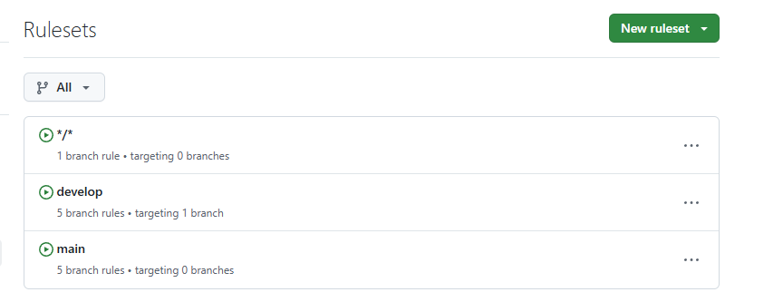

#### Develop branch rules

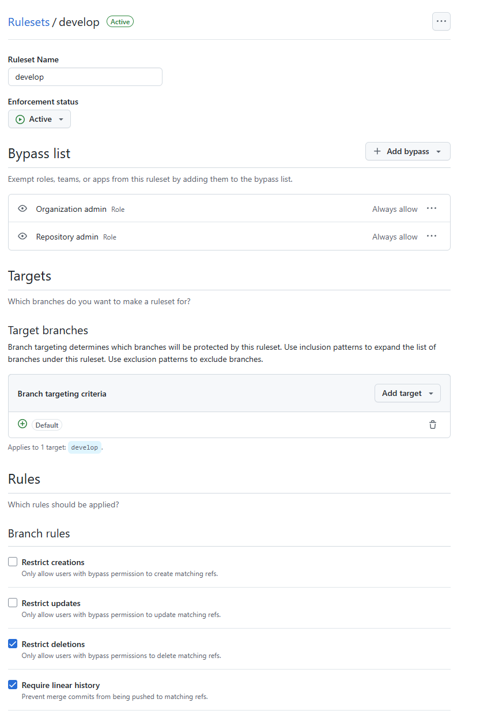

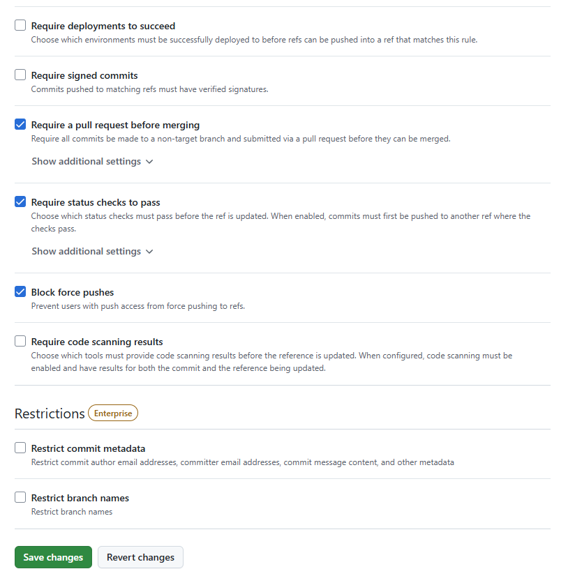

#### Main branch rules

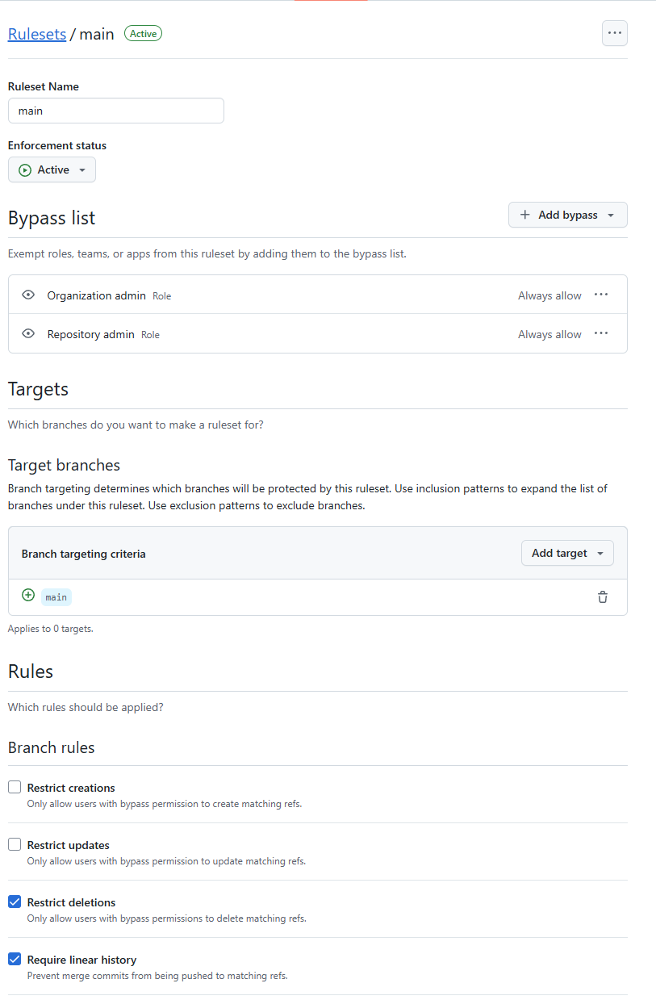

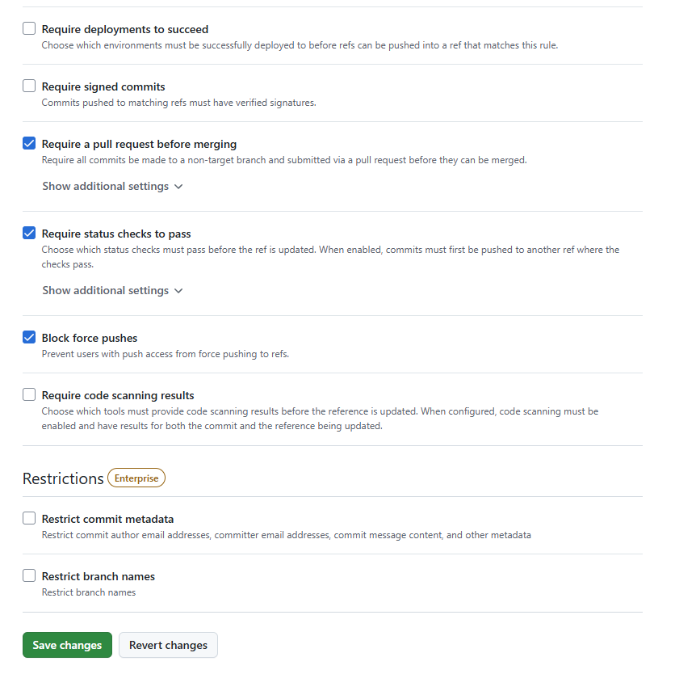

#### \*/\* branch rules

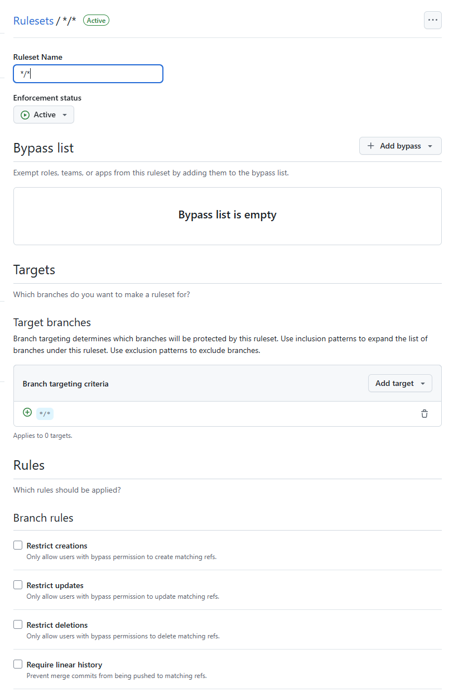

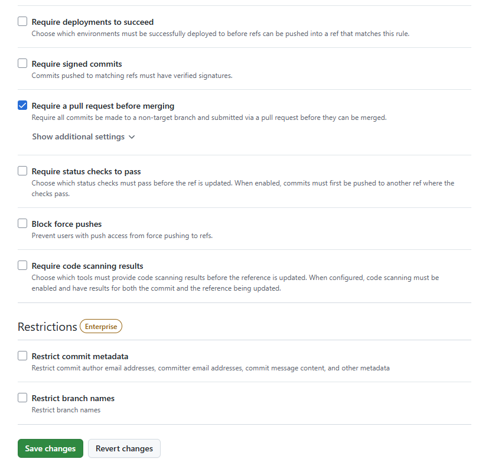

### Classic Rulesets

#### Branch rule high level

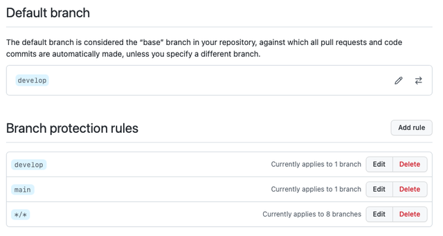

#### Develop branch rules

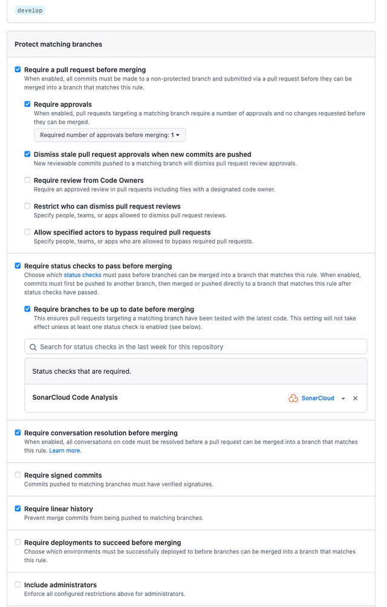

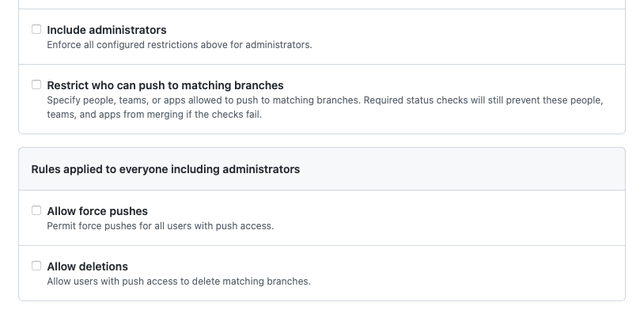

#### Main branch rules

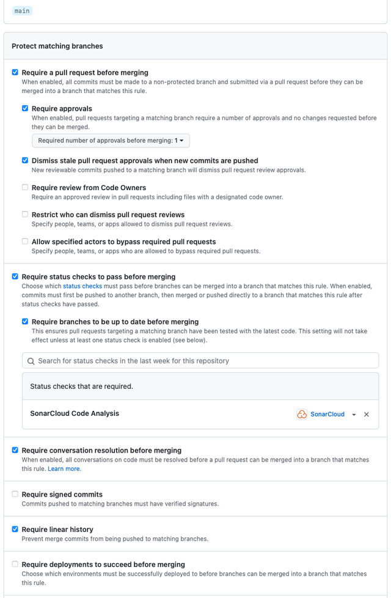

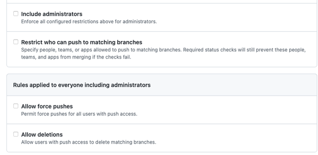

#### \*/\* branch rules

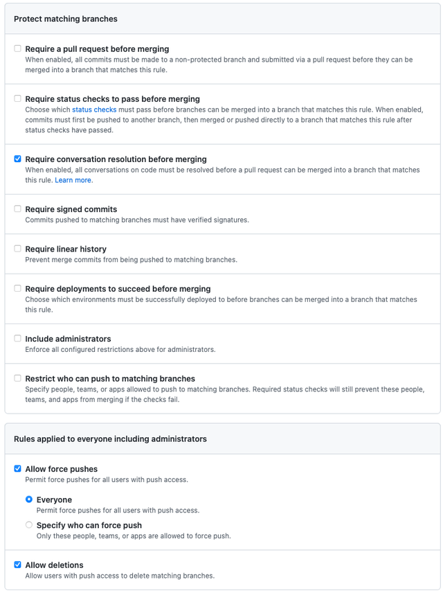

## Environment Settings and SB2

[See the SB2 new service setup guide](https://fivium.atlassian.net/wiki/spaces/BESPOKE/pages/729645094/SB2+new+service+setup+guide)
