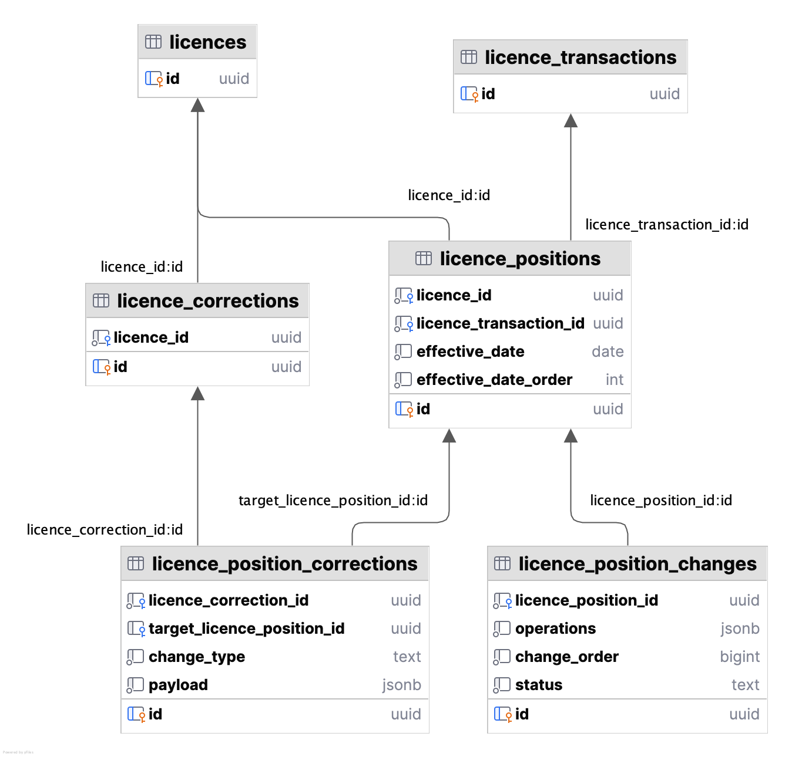

# Correction data model

## Requirements

- Changes made to a licence should not be visible on the main licence unless they have an 'executed' status
- During a correction, positions can be created, removed and updated
- Licence positions contain multiple changes which group operations together
- Licence position changes can be applied independently of each other
- Users can move change changes and operations or remove them entirely during the correction process
- Users can re-order licence positions and changes within a position

## Data model part 1

```sql
CREATE TABLE licences (
    id UUID PRIMARY KEY
);

CREATE TABLE licence_transactions (
    id UUID PRIMARY KEY
);

CREATE TABLE licence_positions (
    id                     UUID PRIMARY KEY,
    licence_id             UUID NOT NULL REFERENCES licences(id),
    licence_transaction_id UUID NOT NULL REFERENCES licence_transactions(id),
    effective_date         DATE NOT NULL,
    effective_date_order   INT  NOT NULL
);

CREATE TABLE licence_position_changes (
    id                  UUID PRIMARY KEY,
    licence_position_id UUID   NOT NULL REFERENCES licence_positions(id),
    operations          JSONB  NOT NULL,
    change_order        BIGINT NOT NULL,
    status              TEXT   NOT NULL -- consent, not consented
);

CREATE TABLE licence_corrections (
    id         UUID PRIMARY KEY,
    licence_id UUID NOT NULL REFERENCES licences(id)
);

CREATE TABLE licence_position_corrections (
    id                         UUID PRIMARY KEY,
    licence_correction_id      UUID  NOT NULL REFERENCES licence_corrections(id),
    target_licence_position_id UUID REFERENCES licence_positions(id),
    change_type                TEXT  NOT NULL CHECK (change_type IN ('ADD_POSITION', 'REMOVE_POSITION', 'UPDATE_POSITION')),
    payload                    JSONB NOT NULL
);
```



## Correction examples

### Creating a new licence position

To create a new licence position, a row will be inserted into the `licence_position_corrections` table. It will
have an 'ADD_POSITION' change type, and the payload will contain the new position's data. When the correction is
applied, the new position is created and any changes within are propagated into the `licence_position_changes` table.

```sql
-- target_licence_position_id will be null in this case, the position_id will be within the payload
INSERT INTO licence_position_corrections (licence_correction_id, change_type, payload) 
VALUES ('correction-id', 'ADD_POSITION', '{...}'::jsonb);
```

```typescript
type CreateLicencePositionPayload = {
  licencePositionId: string, // on apply, this will be passed down to each 'change' for relational storage
  licenceTransactionId: string, // on apply, use this id to create the transaction and link this position to it
  effectiveDate: string,
  effectiveDateOrder: number,
  changes: Array<LicencePositionChange>
}
```

### Removing a licence position

To remove a licence position, a row will be inserted into the `licence_position_corrections` table. It will 
have a 'REMOVE_POSITION' change type, and the `target_licence_position_id` will be the id of the position to remove.
When the correction is applied, the position row and its changes are removed from the `licence_positions` and 
`licence_position_changes` tables. The _aud tables will audit the removal of this data.

```sql
INSERT INTO licence_position_corrections (licence_correction_id, change_type, target_licence_position_id) 
VALUES ('correction-id', 'REMOVE_POSITION', 'position-id');
```

> No payload is required for this change type.

### Updating a licence position

To update a licence position, a row will be inserted into the `licence_position_corrections` table. It will 
have an 'UPDATE_POSITION' change type. The payload will contain position and change data that will be written back to the 
`licence_positions` and `licence_position_changes` tables once the correction is applied.

```sql
INSERT INTO licence_position_corrections (licence_correction_id, change_type, target_licence_position_id, payload) 
VALUES ('correction-id', 'UPDATE_POSITION', 'position-id', '{...}'::jsonb);
```

The payload will contain position data if it is changed during the correction. This can include things like the 
effective date and date order. If changes are updated, they will be stored in the payload and once applied, will be
written back to the `licence_position_changes` table once the correction is applied. 

```typescript
// only 2 examples shown. other operations will also have a 'type' and its relevant attributes to descibe the operation
type LicenceOperation =
  { type: "licence-administrator", operator: number } 
| { type: "equity-transfer", fromOperator: number, toOperator: number, amountPercentage: number };

type LicencePositionChangeOperation = 
  { type: "add-operation", operationId: string, operation: LicenceOperation }
| { type: "update-operation", operationId: string, operation: LicenceOperation }
| { type: "remove-operation", operationId: string }

type LicencePositionChange = 
  { type: "add-change", changeId: string, changeOrder: number, operations: Array<LicencePositionChangeOperation> }
| { type: "update-change-operations", changeId: string, operations: Array<LicencePositionChangeOperation> }
| { type: "update-change-order", changeId: string, changeOrder: number }
| { type: "remove-change", changeId: string }

// here all fields are optional, but at least one must be provided
type UpdateLicencePositionPayload = {
  effectiveDate?: string, // if present, on apply, this will be written back to the given licence_position
  effectiveDateOrder?: number, // same as above
  changes?: Array<LicencePositionChange>
}
````

Operations within changes can also be changed and moved around.

If an operation is updated within a change, the payload will contain the operation in full (including its id). Once the
correction is applied, the operation for that id will be overwritten in the `licence_position_changes` table.

If an operation is removed from a change, we'd store a change_type of 'REMOVE_OPERATION' and the id of the operation to remove.
Once the correction is applied, the operation will be removed from the `licence_position_changes` table.

If an operation is moved within a change, we'd store the complete list of operations for the change, and once applied, the
positions will be written back to the `licence_position_changes` table for the given change.