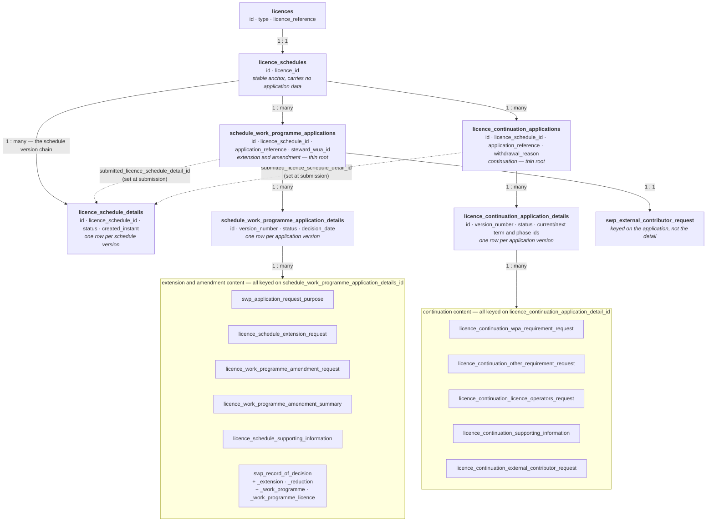

# Licence Applications — Extension and Amendment, and Continuation Data Model

How the Licensing Management Service (LMS) stores the two kinds of licence application
industry can submit against a licence schedule — the **extension and amendment application**
and the **continuation application** — what happens in the database as an application is
started, submitted and decided, and the enumerated values that appear in the data.

This document describes the *database* behaviour only. It assumes no access to the LMS
codebase. All table and column names below are the live PostgreSQL names.

It is the companion to `licence-schedules-data-model.md`, which covers the schedule itself.
Read that first: applications are anchored to schedules, and the single most important fact
about schedules — that **every change produces a brand-new set of rows for the whole
schedule** — governs how application rows point at schedule rows (§7).

---

## 1. Vocabulary

| Term | Meaning |
|---|---|
| **Application** | A request from a licensee to change something about a licence. LMS has exactly two types (§3). |
| **Extension and amendment application** (EAA) | "I want to extend a term, phase or work programme activity due date, or amend a work programme activity." Stored under `schedule_work_programme_applications`. Referred to in code and column names as *SWP* (schedule work programme). |
| **Continuation application** (CA) | "I want to continue into the next term or phase of my production licence." Stored under `licence_continuation_applications`. |
| **Application version** (a.k.a. *application detail*) | The mutable part of an application — status, timestamps, responsible organisation, and all the answers given in the journey. One row per version; today there is always exactly one (§11.1). |
| **Request** | A single thing being asked for within an application — one term extension, one work programme activity amendment, one requirement answer. Each has its own table. |
| **Record of decision** (ROD) | The regulator's recorded outcome for an extension and amendment application. Lives in the `swp_record_of_decision*` tables (§5.7). |
| **Steward** | The NSTA user allocated to progress an extension and amendment application. `schedule_work_programme_applications.steward_wua_id`. |

Two structural facts drive almost every query:

1. **The application root table is thin; the detail table holds the state.** This mirrors the
   `licence_schedules` / `licence_schedule_details` split, but for a different reason — here
   the root exists to carry the application reference and the schedule binding, which must
   not change once set.
2. **Application rows point at *version-specific* schedule rows.** A term id, phase id or work
   programme activity id held on an application row belongs to one `licence_schedule_details`
   version. §7 explains what to do about that.

---

## 2. How the tables fit together

```
                          licences (id INTEGER)
                                   │  1 : 1
                                   ▼
                      licence_schedules (id UUID, licence_id)
                                   │
        ┌──────────────────────────┼──────────────────────────┐
        │ 1 : many                 │ 1 : many                 │ 1 : many
        ▼                          ▼                          ▼
licence_schedule_          schedule_work_programme_   licence_continuation_
details                    applications               applications
(the version chain)                │                          │
                                   ▼                          ▼
                           schedule_work_programme_   licence_continuation_
                           application_details        application_details
                                   │                          │
                                   ▼                          ▼
                           request + decision tables  requirement tables
                           (§5)                       (§6)
```

- Both application root tables hang off `licence_schedules`, **not** off `licences` and not
  off a schedule version. A licence with no schedule cannot have an application.
- Both root tables additionally carry `submitted_licence_schedule_detail_id`, a nullable
  pointer to the exact schedule version the application was submitted against (§7.1).
- Every journey answer lives in a child table keyed on the **application detail** id — with
  one exception, on the extension and amendment side, which keys on the **application** id
  instead (§11.4).

### 2.1 Entity relationship diagram

Read top to bottom: each layer is keyed on the layer above it.



---

## 3. The two application types

The application type is not stored in any column — it is implied by which pair of tables the
row lives in. It appears as a **string** in two places outside these tables: the team scope
(§9) and the document instance item type (§10).

| Value | Display | Reference prefix | Root table | Licence types that can start one |
|---|---|---|---|---|
| `SCHEDULE_AMENDMENT_APPLICATION` | Licence and work programme extension and amendment application | `LMS/EAA/` | `schedule_work_programme_applications` | Landward production, Seaward production, Carbon storage |
| `CONTINUATION_APPLICATION` | Licence continuation application | `LMS/CA/` | `licence_continuation_applications` | Landward production, Seaward production |

Note the mismatch between the stored name and everything user-facing: the value is
`SCHEDULE_AMENDMENT_APPLICATION`, the reference prefix is `EAA`, the table prefix is `swp`,
and the display name is "extension and amendment". All four refer to the same thing.

Both types are additionally behind release feature flags, so availability in a given
environment is not a property of the data.

---

## 4. Application status — the lifecycle both types share

`status` is stored as `TEXT` on the *detail* table of both families, from one shared value
set:

| Value | Meaning | Searchable in the work area |
|---|---|---|
| `DRAFT` | Being built by the licensee. Not visible to the regulator. | Yes |
| `SUBMITTED` | Submitted to the NSTA and under assessment. | Yes |
| `ISSUE_DECISION` | A decision has been recorded and the decision letter is being prepared or issued. | Yes |
| `COMPLETE` | The decision letter has been issued. | Yes |
| `WITHDRAWN` | Withdrawn after submission, with a reason. | Yes |
| `DELETED` | An abandoned draft. **The rows are not physically deleted** — the status is flipped and everything stays in place. | No |

```
      (licensee starts an application)
                  │
                  ▼
                DRAFT ──────── abandon ────────► DELETED
                  │
                  │ submit  (reference + schedule binding assigned here)
                  ▼
              SUBMITTED ─────── withdraw ───────► WITHDRAWN
                  │
                  │ record decision
                  ▼
            ISSUE_DECISION
                  │
                  │ issue letter
                  ▼
               COMPLETE
```

**The two families do not use the same portion of this lifecycle.**

| Status | Extension and amendment | Continuation |
|---|---|---|
| `DRAFT` | yes | yes |
| `SUBMITTED` | yes | yes |
| `ISSUE_DECISION` | yes — set when the final decision is recorded | yes — set when the decision is confirmed |
| `COMPLETE` | **never set** | yes — set when the continuation letter is issued |
| `WITHDRAWN` | **never set** | yes |
| `DELETED` | yes | yes |

An extension and amendment application therefore terminates at `ISSUE_DECISION` today. Do not
read the absence of `COMPLETE` rows on that side as a data problem, and do not build a
"completed applications" report that assumes both families reach the same terminal state.

`DELETED` rows are abandoned drafts that were never submitted. Exclude them from reporting;
they are dead weight, not history.

---

## 5. Extension and amendment application

### 5.1 The root and detail rows

```
schedule_work_programme_applications
  id                                   UUID PK
  licence_schedule_id                  UUID NOT NULL → licence_schedules.id
  submitted_licence_schedule_detail_id UUID          → licence_schedule_details.id  (null until submission)
  application_reference                TEXT          UNIQUE, null until submission
  steward_wua_id                       INTEGER       Energy Portal wua id, null until allocated
```

```
schedule_work_programme_application_details
  id                                     UUID PK
  schedule_work_programme_application_id UUID → schedule_work_programme_applications.id
  version_number                         INTEGER      always 1 (§11.1)
  status                                 TEXT         §4
  all_licensees_permission_confirmed     BOOLEAN      captured on the first page of the journey
  created_datetime                       TIMESTAMPTZ NOT NULL
  submitted_datetime                     TIMESTAMPTZ  null until submission
  submitted_by_wua_id                    INTEGER      null until submission
  responsible_organisation_unit_id       INTEGER      Energy Portal organisation unit
  decision_date                          DATE         set when the final decision is recorded
```

Starting an application inserts one row in each table plus a scoped external contributors
team (§9). The schedule version the licence had `ACTIVE` at that moment is *not* recorded yet —
only `licence_schedule_id` is, which is the stable anchor, not a version.

### 5.2 `swp_application_request_purpose` — what is being asked for

One row per application detail, written at the first journey step.

```
id                                            UUID PK
schedule_work_programme_application_detail_id UUID → ..._details.id   ← singular "detail" (§11.4)
extend_phase_or_term                          BOOLEAN NOT NULL
extend_term                                   BOOLEAN NOT NULL
amend_work_programme                          BOOLEAN NOT NULL
```

The three booleans are independent checkboxes, not a single choice, and which of them are
*offered* depends on the licence type:

| Option | Column | Offered when |
|---|---|---|
| Extend a phase or term | `extend_phase_or_term` | the licence type has terms **and** captures phases |
| Extend a term | `extend_term` | the licence type has terms but does **not** capture phases |
| Amend the work programme | `amend_work_programme` | the licence type has a work programme **and** the schedule has at least one current work programme activity |

`extend_phase_or_term` and `extend_term` are therefore mutually exclusive by construction — a
licence type offers one or the other, never both. A row with both set is malformed.

### 5.3 `licence_schedule_extension_request` — requested extensions

One row per term or phase the licensee wants extended.

```
id                                             UUID PK
schedule_work_programme_application_details_id  UUID NOT NULL   ← plural "details" (§11.4)
term_id                                        UUID   → a licence_schedule_terms row   (no FK)
phase_id                                       UUID   → a licence_schedule_phases row  (no FK)
extension_duration_days                        INTEGER NOT NULL
extension_duration_months                      INTEGER NOT NULL
extension_duration_years                       INTEGER NOT NULL
```

- Exactly one of `term_id` / `phase_id` is populated per row; the other is null.
- The duration is a **calendar** duration held as three integers, the same convention used
  throughout the schedule model. It cannot be flattened to a day count without losing meaning.
- There is at most one row per application detail per term and per phase, but this is enforced
  in application code only — unlike the decision-side equivalents, which do have partial
  unique indexes (§5.7).
- Deleting an extension request from a draft physically deletes the row.

### 5.4 `licence_work_programme_amendment_request` — requested work programme amendments

One row per work programme activity the licensee wants amended.

```
id                                              UUID PK
schedule_work_programme_application_details_id   UUID NOT NULL
work_programme_activity_id                      UUID   → a work_programme_activities row (no FK)
work_programme_completion_date_change_requested  BOOLEAN
work_programme_extension_duration_days           INTEGER
work_programme_extension_duration_months         INTEGER
work_programme_extension_duration_years          INTEGER
work_programme_change_requested                 BOOLEAN
work_programme_amendment_information             TEXT
```

The two booleans gate the fields below them:

| Boolean | When true | When false |
|---|---|---|
| `work_programme_completion_date_change_requested` | the three `work_programme_extension_duration_*` columns carry the requested extension | expect those three columns null |
| `work_programme_change_requested` | `work_programme_amendment_information` carries the free-text description of the change wanted | expect that column null |

At least one of the two is true on a saved row — an amendment request that asks for neither a
date change nor a text change is malformed. Both may be true at once.

### 5.5 `licence_work_programme_amendment_summary` — "anything else?"

One row per application detail, recording the licensee's answer to whether more amendments are
coming.

```
id                                                UUID PK
schedule_work_programme_application_details_id     UUID NOT NULL
licence_work_programme_amendment_summary_options   TEXT   ← §8.2
```

`YES_LATER` is the value that matters for reporting: it marks an application the licensee
intends to add to, and it is the answer that keeps the section incomplete on the task list.

### 5.6 `licence_schedule_supporting_information` — the narrative

One row per application detail. Four free-text fields, all nullable.

```
id                                             UUID PK
schedule_work_programme_application_details_id  UUID NOT NULL
licence_progress                               TEXT
reason_for_amendment                           TEXT
plan_during_extension                          TEXT
impact_on_deliverables                         TEXT
```

Supporting **documents** are not in this table — see §10.

### 5.7 Record of decision

The regulator's outcome is recorded across five tables. All are keyed on the application
detail with the **singular** `schedule_work_programme_application_detail_id`.

**`swp_record_of_decision`** — one row per application detail, the headline outcome.

```
id                                            UUID PK
schedule_work_programme_application_detail_id UUID NOT NULL
extension_decision                            TEXT   ← §8.3
work_programme_decision                       TEXT   ← §8.3
work_programme_summary_option                 TEXT   ← §8.4
```

Both decision columns use the same three-value set, and `NOT_REQUESTED` is the value to expect
where the licensee did not ask for that kind of change at all. So a null decision means "not
yet recorded"; `NOT_REQUESTED` means "recorded, and there was nothing to decide".

**`swp_record_of_decision_extension`** and **`swp_record_of_decision_reduction`** — the
per-term and per-phase durations the NSTA actually granted. Identical shape apart from the
duration column prefix:

```
id                                            UUID PK
schedule_work_programme_application_detail_id UUID NOT NULL
term_id                                       UUID   (no FK)
phase_id                                      UUID   (no FK)
extension_duration_days / _months / _years    INTEGER NOT NULL   (reduction_duration_* on the reduction table)
```

Both carry **partial unique indexes** on `(application detail, term_id) WHERE term_id IS NOT
NULL` and `(application detail, phase_id) WHERE phase_id IS NOT NULL`. So unlike the request
side, at most one extension row and one reduction row per term or phase per application is
guaranteed by the schema.

The regulator chooses one of three outcomes per term or phase, and the choice is expressed by
*which table holds a row*, not by a stored value:

| Choice | Result in the database |
|---|---|
| Extend | a row in `swp_record_of_decision_extension` |
| Reduce | a row in `swp_record_of_decision_reduction` |
| Maintain | **no row in either table** |

"Maintain" is therefore indistinguishable from "not yet decided" at row level. Use
`swp_record_of_decision.extension_decision` being non-null to establish that the decision was
made, then the absence of rows to establish which items were maintained. A term or phase with
a row in *both* tables is malformed.

**`swp_record_of_decision_work_programme`** — one row per work programme activity decided.

```
id                                            UUID PK
schedule_work_programme_application_detail_id UUID NOT NULL
work_programme_activity_id                    UUID NOT NULL → work_programme_activities.id  (FK enforced here)
decision                                      TEXT NOT NULL ← §8.5
amend_duration                                BOOLEAN
amend_text                                    BOOLEAN
amended_duration_days / _months / _years      INTEGER
amended_text                                  TEXT
```

Unique on `(application detail, work programme activity)`. The `amend_*` booleans gate the
columns below them exactly as on the request side (§5.4), and are only meaningful when
`decision = 'AMEND'`.

**`swp_record_of_decision_work_programme_licence`** — the licences a commitment was moved to.

```
id                                   UUID PK
record_of_decision_work_programme_id UUID NOT NULL → swp_record_of_decision_work_programme.id
licence_id                           INTEGER NOT NULL → licences.id
```

Unique on the pair. Populated only for `decision = 'COMPLETE_ON_ANOTHER_LICENCE'`; a
commitment can move to more than one licence, hence a child table rather than a column.

### 5.8 What the decision does *not* do

**Recording a decision does not change the licence schedule.** Nothing in the decision tables
writes back to `licence_schedule_terms`, `licence_schedule_phases` or
`work_programme_activities`, and no new `licence_schedule_details` version is created as a
result. A granted extension exists in the decision tables and in the issued letter; applying
it to the live schedule is a separate manual "update an existing licence schedule" journey
performed by a Licence Management user.

The practical consequence: **`swp_record_of_decision_extension` is a record of intent, not a
record of what the schedule says.** Do not reconcile the two by assuming they must agree, and
do not compute current term end dates from decision rows.

---

## 6. Continuation application

### 6.1 The root and detail rows

```
licence_continuation_applications
  id                                   UUID PK
  licence_schedule_id                  UUID NOT NULL → licence_schedules.id
  submitted_licence_schedule_detail_id UUID          → licence_schedule_details.id (null until submission)
  application_reference                TEXT          UNIQUE, null until submission
  withdrawal_reason                    TEXT          set when withdrawn
```

```
licence_continuation_application_details
  id                                  UUID PK
  licence_continuation_application_id  UUID → licence_continuation_applications.id
  version_number                      INTEGER      always 1 (§11.1)
  status                              TEXT         §4
  created_date_time                   TIMESTAMPTZ  ← note: not created_datetime (§11.3)
  submitted_datetime                  TIMESTAMPTZ  null until submission
  submitted_by_wua_id                 INTEGER      null until submission
  responsible_organisation_unit_id    INTEGER
  current_term_id                     UUID → licence_schedule_terms.id   (FK enforced)
  current_phase_id                    UUID → licence_schedule_phases.id  (FK enforced)
  next_term_id                        UUID → licence_schedule_terms.id   (FK enforced)
  next_phase_id                       UUID → licence_schedule_phases.id  (FK enforced)
```

The four term and phase columns are a **snapshot of the schedule state taken at submission**
(§7.2). They are null on a draft. Any of the four may legitimately be null even after
submission — a licence in its final term has no next term, and a licence type that does not
capture phases has neither phase.

Which term or phase is "current" is evaluated as `start_date <= today AND end_date > today` —
start inclusive, end exclusive, the same rule the schedule model uses throughout.

### 6.2 `licence_continuation_wpa_requirement_request` — work programme readiness

One row per application detail.

```
id                                            UUID PK
licence_continuation_application_detail_id    UUID → ..._details.id
work_programme_activities_completion_status   BOOLEAN   have all activities been completed?
actions_to_complete_work_programme_activities TEXT      required when the above is false
further_information                           TEXT
```

### 6.3 `licence_continuation_other_requirement_request` — the conditional requirements

One row per application detail, holding up to three yes/no + explanation pairs.

```
id                                            UUID PK
licence_continuation_application_detail_id    UUID
financial_capacity_evidence_submission_status BOOLEAN
actions_to_provide_financial_evidence         TEXT
development_consent_grant_status              BOOLEAN
actions_to_approve_development_consent        TEXT
relinquishment_requirement_status             BOOLEAN
actions_to_relinquish_required_licence_area   TEXT
```

**Which of the three pairs is asked for depends on the schedule, not the licence type**, and
all three are driven off the *next* term or phase — the one being continued into:

| Requirement | Shown when |
|---|---|
| Financial capacity | the next phase is `PHASE_C`, or the next term is `SECOND` or `THIRD` |
| Development consent | the next term is `THIRD` |
| Relinquishment | the schedule has a `MANDATORY_RELINQUISHMENT` other schedule event falling within the relevant schedule window |

So nulls in this table are the normal case, and a null does not mean an unanswered question —
it usually means the question was never asked. Reconstructing which questions *were* asked
requires the schedule state, and for submitted applications that is the snapshot on the detail
row (§6.1), not the schedule as it stands today.

### 6.4 `licence_continuation_licence_operators_request` — pending actions

One row per application detail — modelled as a one-to-one in the application, though no unique
constraint enforces it.

```
id                                         UUID PK
licence_continuation_application_detail_id UUID
pending_actions_explanation                TEXT
```

### 6.5 `licence_continuation_supporting_information`

One row per application detail.

```
id                                         UUID PK
licence_continuation_application_detail_id UUID
has_additional_supporting_information      BOOLEAN
```

A boolean only. The documents themselves are in the file upload library (§10), so
`has_additional_supporting_information = true` with no uploaded files is a data-quality signal
rather than a contradiction the schema prevents.

### 6.6 `licence_continuation_external_contributor_request`

```
id                                         UUID PK
licence_continuation_application_detail_id UUID
add_external_contributors                  BOOLEAN
```

Note this keys on the application **detail**, whereas its extension and amendment counterpart
keys on the **application** (§11.4).

---

## 7. How applications bind to a schedule

### 7.1 `submitted_licence_schedule_detail_id`

Null while the application is a draft. On submission, both families set it to the schedule
version that was `ACTIVE` for the licence **at that moment**, and never change it again.

This gives the correct rule for resolving an application's schedule:

```sql
-- the schedule version an application should be read against
SELECT COALESCE(
         app.submitted_licence_schedule_detail_id,
         (SELECT lsd.id
            FROM licence_schedule_details lsd
           WHERE lsd.licence_schedule_id = app.licence_schedule_id
             AND lsd.status = 'ACTIVE')
       ) AS schedule_detail_id
FROM schedule_work_programme_applications app
WHERE app.id = :application_id;
```

That is: **use the submitted version if there is one, otherwise the currently active
version.** A draft moves with the licence's live schedule; a submitted application is frozen
against the version it was submitted against, even after the licence's schedule is updated
several times over.

### 7.2 Why continuation also snapshots term and phase

The continuation detail's `current_term_id` / `current_phase_id` / `next_term_id` /
`next_phase_id` are populated at submission from the schedule state of that same active
version. They are a convenience snapshot: the rows they point at belong to the submitted
schedule version and remain readable after that version becomes `REPLACED`.

The extension and amendment side has no equivalent — it re-derives what it needs from
`submitted_licence_schedule_detail_id` each time.

### 7.3 Following an application's targets across schedule versions

`licence_schedule_extension_request.term_id`, `.phase_id` and
`licence_work_programme_amendment_request.work_programme_activity_id` all point at rows
belonging to **one schedule version**. When the licence schedule is next updated, those rows
are copied to a new version with fresh ids, and the application keeps pointing at the old
ones — which still exist, under a `REPLACED` version.

To follow the same logical schedule event, go via `schedule_events.original_event_id`, exactly
as described in the schedule data model:

```sql
-- what does the amendment request's activity look like in the CURRENT schedule?
SELECT cur.category, cur.commitment, cur.due_date
FROM licence_work_programme_amendment_request req
JOIN schedule_events se_req ON se_req.id = req.work_programme_activity_id
JOIN schedule_events se_cur ON se_cur.original_event_id = se_req.original_event_id
JOIN work_programme_activities cur ON cur.id = se_cur.id
JOIN licence_schedule_details lsd ON lsd.id = cur.licence_schedule_detail_id
WHERE req.id = :request_id
  AND lsd.status = 'ACTIVE';
```

This can legitimately return no rows: the activity may have been deleted from the schedule in
a later version while the application still references it.

### 7.4 Application rows are never duplicated with the schedule

Every application-side table is explicitly excluded from the schedule duplication system. When
a new schedule version is created, none of the request, requirement or decision rows are
copied. Applications live entirely outside the schedule version chain and are unaffected by
it — which is exactly why §7.3 is needed.

---

## 8. Enumerated values

All enums are persisted as their **Java constant name in a `TEXT` column** — no numeric codes,
no lookup tables, no database `CHECK` constraints or `ENUM` types. Display strings are held in
code and are **not** present in the database. A value outside these lists is a data-quality
signal, not a documentation gap.

### 8.1 `status` on both application detail tables

`DRAFT`, `SUBMITTED`, `ISSUE_DECISION`, `COMPLETE`, `WITHDRAWN`, `DELETED` — see §4, including
which values each family actually uses.

### 8.2 `licence_work_programme_amendment_summary.licence_work_programme_amendment_summary_options`

| Value | Display |
|---|---|
| `YES_NOW` | Yes, I want to request to amend it now |
| `YES_LATER` | Yes, but I will request to amend it later |
| `NO` | No, I have requested to amend all work programme activities I need to |

### 8.3 `swp_record_of_decision.extension_decision` and `.work_programme_decision`

| Value | Display |
|---|---|
| `GRANTED` | Yes |
| `REJECTED` | No - not approved |
| `NOT_REQUESTED` | No - not requested |

### 8.4 `swp_record_of_decision.work_programme_summary_option`

| Value | Display |
|---|---|
| `YES_NOW` | Yes, I want to add it now |
| `NO_LATER` | No, I will add one later |
| `NO_ALL_ADDED` | No, I have added all work programme activities I need to |

Note this shares the value `YES_NOW` with §8.2 but is a different enum with different
remaining values — do not join or group the two columns together.

### 8.5 `swp_record_of_decision_work_programme.decision`

| Value | Display | Effect on the row |
|---|---|---|
| `AMEND` | Amend duration or text | `amend_duration` / `amend_text` and their fields populated |
| `WAIVE` | Waive | amendment fields null |
| `COMPLETE_ON_ANOTHER_LICENCE` | To be completed on another licence | one or more `swp_record_of_decision_work_programme_licence` rows |
| `ACKNOWLEDGE` | Acknowledge - no further action | amendment fields null |

### 8.6 Duration change type — **not stored**

The regulator's per-term choice of Maintain / Reduce / Extend has no column. It is expressed by
which of the two decision tables holds a row (§5.7). There is nothing to query for it directly.

### 8.7 Request purpose options — **not stored as an enum**

The three options (Extend a phase or term, Extend a term, Amend the work programme) are stored
as three booleans on `swp_application_request_purpose`, not as a value (§5.2).

---

## 9. External contributors

Both families let the licensee invite external contributors to help fill in the application.
The invitation itself is a **team**, not an application table:

```
teams
  id         UUID PK
  type       TEXT   ← EXTERNAL_CONTRIBUTORS
  scope_type TEXT   ← the application type name (§3)
  scope_id   TEXT   ← see below
```

`teams` is unique on `(type, scope_type, scope_id)` where `scope_type` is not null. Team
membership and roles (`EXTERNAL_APPLICATION_EDITOR`, `EXTERNAL_APPLICATION_VIEWER`) live in
the team role tables.

**The scope id differs between the two families:**

| Family | `scope_type` | `scope_id` | Created when |
|---|---|---|---|
| Extension and amendment | `SCHEDULE_AMENDMENT_APPLICATION` | the **application** id | the application is created |
| Continuation | `CONTINUATION_APPLICATION` | the **application detail** id | the licensee information step is completed |

The `*_external_contributor_request` tables hold only the yes/no answer to "do you want to add
external contributors?", and they follow the same split — the extension and amendment one keys
on the application, the continuation one on the application detail (§11.4). Joining either to a
team requires matching the right id.

---

## 10. Files and decision letters

**No uploaded file is stored in an LMS-owned table.** Uploads go to the shared file upload
library, which keys each file by a `(usage_id, usage_type, document_type)` triple supplied by
LMS. The mapping is:

| Section | `usage_id` | `usage_type` |
|---|---|---|
| Extension and amendment — supporting documents | application **detail** id | `SCHEDULE-AMENDMENT-APP-SUPPORTING-DOCUMENT` |
| Extension and amendment — final decision support papers | application **detail** id | `FINAL-DECISION-SUPPORT-PAPER` |
| Continuation — other requirement documents | application **detail** id | `CONTINUATION-OTHER-REQUIREMENT-DOCUMENT` |
| Continuation — additional supporting documents | application **detail** id | `CONTINUATION-ADDITIONAL-SUPPORTING-DOCUMENT` |
| Continuation — issued letter | **application** id | `APPLICATION-CONTINUATION-LETTER` |

A sixth value, `APPLICATION-SUPPORTING-DOCUMENT`, is declared in code but not used by any
section. Expect no rows for it.

**Decision letters** are document instances in the shared document management library, keyed
by `item_reference` = the application id and `item_type` = the application type name. A
document instance is created at the point the decision is recorded (extension and amendment)
or confirmed (continuation) — i.e. on entry to `ISSUE_DECISION`. Templates are selected by
mnemonic:

| Family | Template type |
|---|---|
| Extension and amendment | `EXTENSION_APPROVAL_LETTER` |
| Continuation | `CONTINUATION_LETTER` |

`document_templates` is the one document table LMS owns; the instances are not in LMS tables.

---

## 11. Caveats and known gotchas

### 11.1 `version_number` is always 1

Both detail tables carry `version_number`, and both root tables can hold many detail rows, but
**nothing in LMS ever creates a second version**. Every application has exactly one detail row
today. Queries that fetch "the latest detail by version number descending" are future-proofing,
not evidence that multiple versions exist. Equally, do not assume the one-to-many will stay
degenerate — join to the detail table rather than assuming one row.

Note the side effect on application references: the running number counts *version 1* details
submitted in the calendar year, so it is effectively a count of distinct applications.

### 11.2 The application reference is assigned at submission, not creation

`application_reference` is null for every draft, and unique across each table once set. The
format is `LMS/EAA/{year}/{n}` and `LMS/CA/{year}/{n}`, where `n` is one more than the number
of applications of that type submitted so far in the current calendar year. The counter
restarts each year, so the reference is only unique *with* its year component.

Two consequences: a `DELETED` draft never consumes a number, and references are allocated at
submission time, so their order matches `submitted_datetime`, not the creation timestamp.

### 11.3 Timestamp columns are named inconsistently between the two families

| Concept | Extension and amendment | Continuation |
|---|---|---|
| Created | `created_datetime` | `created_date_time` |
| Submitted | `submitted_datetime` | `submitted_datetime` |

A query written against one family will not port to the other unchanged. `created_datetime` is
`NOT NULL` on the extension and amendment side; `created_date_time` is nullable on the
continuation side.

### 11.4 The foreign key to the application detail is named three different ways

Within the extension and amendment family alone:

| Column | Tables using it |
|---|---|
| `schedule_work_programme_application_details_id` (plural) | `licence_schedule_extension_request`, `licence_work_programme_amendment_request`, `licence_work_programme_amendment_summary`, `licence_schedule_supporting_information` |
| `schedule_work_programme_application_detail_id` (singular) | `swp_application_request_purpose`, all five `swp_record_of_decision*` tables |
| `schedule_work_programme_application_id` (the **application**, not the detail) | `swp_external_contributor_request` |

The continuation family is consistent — `licence_continuation_application_detail_id`
everywhere — but note that its external contributor table points at the detail while the
extension and amendment equivalent points at the application. The two families genuinely
differ here; it is not a naming artefact.

### 11.5 Several references to schedule rows have no foreign key

| Column | Points at | FK enforced |
|---|---|---|
| `licence_schedule_extension_request.term_id` / `.phase_id` | terms / phases | **no** |
| `licence_work_programme_amendment_request.work_programme_activity_id` | work programme activities | **no** |
| `swp_record_of_decision_extension.term_id` / `.phase_id` | terms / phases | **no** |
| `swp_record_of_decision_reduction.term_id` / `.phase_id` | terms / phases | **no** |
| `swp_record_of_decision_work_programme.work_programme_activity_id` | work programme activities | yes |
| `licence_continuation_application_details.current/next_term_id`, `current/next_phase_id` | terms / phases | yes |

Where there is no constraint, a dangling id is possible in principle and joins should be left
joins. Note that even the enforced ones only guarantee the row exists *somewhere* — they say
nothing about which schedule version it belongs to.

### 11.6 Deletes within a draft are physical; deleting the application is not

Removing one extension or amendment request while editing a draft physically deletes that row.
Deleting the whole application flips `status` to `DELETED` and leaves every child row in place.
So a `DELETED` application still has its full set of request rows, and those rows are not
evidence the application was ever submitted.

### 11.7 A decision is not a schedule change

Covered in §5.8, repeated here because it is the single most likely wrong assumption: granting
an extension in `swp_record_of_decision_extension` does **not** move any date on the licence
schedule. The schedule is updated separately and manually, and until that happens the two
disagree by design.

### 11.8 There is no "approved date" beyond `decision_date`

`schedule_work_programme_application_details.decision_date` is entered by the user recording
the decision, not derived from a timestamp, and the continuation family has no equivalent
column at all. For a genuine "when did this change status" timestamp, use the audit tables
(§12).

### 11.9 User identifiers are external

`submitted_by_wua_id` and `steward_wua_id` are Energy Portal web user account ids, and
`responsible_organisation_unit_id` is an Energy Portal organisation unit id. LMS stores no
names or email addresses for any of them — they are resolved from the Energy Portal at render
time.

---

## 12. Audit history (Hibernate Envers)

Every table in this document has a parallel audit table with the suffix `_aud`
(`schedule_work_programme_application_details_aud`, `licence_continuation_applications_aud`,
`swp_record_of_decision_aud`, and so on). Each holds the same data columns plus:

- `rev` — revision number, FK to `audit_revisions.rev`
- `revtype` — `0` = insert, `1` = update, `2` = delete

Revision metadata lives in the same shared table the schedule model uses:

```
audit_revisions
  rev               SERIAL PK
  created_date_time TIMESTAMPTZ
  user_wua_id       BIGINT      ← who made the change (Energy Portal wua id)
  proxy_user_wua_id BIGINT      ← set when acting on behalf of another user
```

This is the **only** place recording *when* an application changed status and *who* did it,
other than `submitted_datetime` / `submitted_by_wua_id` for the submission step specifically:

```sql
SELECT ar.created_date_time, ar.user_wua_id, d.status
FROM schedule_work_programme_application_details_aud d
JOIN audit_revisions ar ON ar.rev = d.rev
WHERE d.id = :application_detail_id
ORDER BY d.rev;
```

Use it to answer "when was this withdrawn", "when was the decision issued" and "who deleted
this draft", none of which have a dedicated column.

---

## 13. Reference: current columns per table

### Extension and amendment

**`schedule_work_programme_applications`**
`id`, `licence_schedule_id`, `submitted_licence_schedule_detail_id`, `application_reference`,
`steward_wua_id`

**`schedule_work_programme_application_details`**
`id`, `schedule_work_programme_application_id`, `version_number`, `status`,
`all_licensees_permission_confirmed`, `created_datetime`, `submitted_datetime`,
`submitted_by_wua_id`, `responsible_organisation_unit_id`, `decision_date`

**`swp_application_request_purpose`**
`id`, `schedule_work_programme_application_detail_id`, `extend_phase_or_term`, `extend_term`,
`amend_work_programme`

**`licence_schedule_extension_request`**
`id`, `schedule_work_programme_application_details_id`, `term_id`, `phase_id`,
`extension_duration_days`, `extension_duration_months`, `extension_duration_years`

**`licence_work_programme_amendment_request`**
`id`, `schedule_work_programme_application_details_id`, `work_programme_activity_id`,
`work_programme_completion_date_change_requested`, `work_programme_extension_duration_days`,
`work_programme_extension_duration_months`, `work_programme_extension_duration_years`,
`work_programme_change_requested`, `work_programme_amendment_information`

**`licence_work_programme_amendment_summary`**
`id`, `schedule_work_programme_application_details_id`,
`licence_work_programme_amendment_summary_options`

**`licence_schedule_supporting_information`**
`id`, `schedule_work_programme_application_details_id`, `licence_progress`,
`reason_for_amendment`, `plan_during_extension`, `impact_on_deliverables`

**`swp_external_contributor_request`**
`id`, `schedule_work_programme_application_id`, `add_external_contributors`

**`swp_record_of_decision`**
`id`, `schedule_work_programme_application_detail_id`, `extension_decision`,
`work_programme_decision`, `work_programme_summary_option`

**`swp_record_of_decision_extension`**
`id`, `schedule_work_programme_application_detail_id`, `term_id`, `phase_id`,
`extension_duration_days`, `extension_duration_months`, `extension_duration_years`

**`swp_record_of_decision_reduction`**
`id`, `schedule_work_programme_application_detail_id`, `term_id`, `phase_id`,
`reduction_duration_days`, `reduction_duration_months`, `reduction_duration_years`

**`swp_record_of_decision_work_programme`**
`id`, `schedule_work_programme_application_detail_id`, `work_programme_activity_id`,
`decision`, `amend_duration`, `amend_text`, `amended_duration_days`, `amended_duration_months`,
`amended_duration_years`, `amended_text`

**`swp_record_of_decision_work_programme_licence`**
`id`, `record_of_decision_work_programme_id`, `licence_id`

### Continuation

**`licence_continuation_applications`**
`id`, `licence_schedule_id`, `submitted_licence_schedule_detail_id`, `application_reference`,
`withdrawal_reason`

**`licence_continuation_application_details`**
`id`, `licence_continuation_application_id`, `version_number`, `status`, `created_date_time`,
`submitted_datetime`, `submitted_by_wua_id`, `responsible_organisation_unit_id`,
`current_term_id`, `current_phase_id`, `next_term_id`, `next_phase_id`

**`licence_continuation_wpa_requirement_request`**
`id`, `licence_continuation_application_detail_id`,
`work_programme_activities_completion_status`,
`actions_to_complete_work_programme_activities`, `further_information`

**`licence_continuation_other_requirement_request`**
`id`, `licence_continuation_application_detail_id`,
`financial_capacity_evidence_submission_status`, `actions_to_provide_financial_evidence`,
`development_consent_grant_status`, `actions_to_approve_development_consent`,
`relinquishment_requirement_status`, `actions_to_relinquish_required_licence_area`

**`licence_continuation_licence_operators_request`**
`id`, `licence_continuation_application_detail_id`, `pending_actions_explanation`

**`licence_continuation_supporting_information`**
`id`, `licence_continuation_application_detail_id`, `has_additional_supporting_information`

**`licence_continuation_external_contributor_request`**
`id`, `licence_continuation_application_detail_id`, `add_external_contributors`
