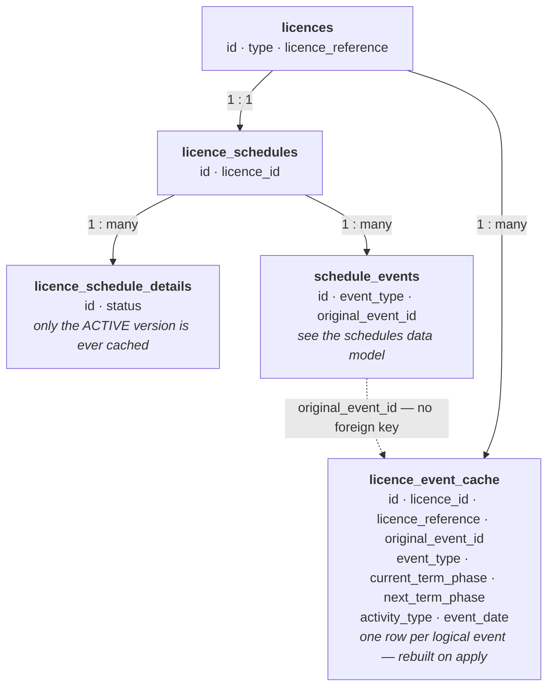

# Licence Event Cache — Data Model and Refresh Behaviour

How the Licensing Management Service (LMS) stores the flattened copy of schedule events that
backs the cross licence event tracker, when it is rebuilt, and which of its columns are
actually populated.

This document describes the *database* behaviour only. It assumes no access to the LMS
codebase. All table and column names below are the live PostgreSQL names.

The schedule this table is derived from is described in `licence-schedules-data-model.md`, and
the vocabulary here (schedule event, schedule version, `original_event_id`) is that document's.

---

## 1. What this is

The cross licence event tracker is a screen that lists upcoming schedule events across many
licences at once, with filtering and sorting. Assembling that from the schedule tables would
mean joining the event supertype, six child tables and the term and phase hierarchy on every
page load.

`licence_event_cache` is a **flat, denormalised copy** of the events that screen shows, written
when a schedule is applied and read directly afterwards.

**It is a read model, not a source of truth.** Nothing in the service treats it as
authoritative, and it is never the right table to answer a question about what a licence
schedule says. If it disagrees with the schedule tables, the schedule tables are right.

---

## 2. How it fits together

```
licences (id INTEGER)
        │  licence_id (FK)
        ▼
licence_event_cache
        one row per logical schedule event, identified by original_event_id
```

There is **one foreign key only** — to `licences`. `original_event_id` is a plain `UUID`
column with no constraint behind it, even though its values come from
`schedule_events.original_event_id`. Nothing in the database ties a cache row to the event it
was derived from, and nothing removes a cache row when that event disappears.

### 2.1 Entity relationship diagram

Read top to bottom: each layer is keyed on the layer above it.



The dotted edge is the one that matters: it is a value correspondence, not a constraint.

---

## 3. `licence_event_cache`

```
id                 UUID PK
licence_id         INTEGER NOT NULL → licences.id
licence_reference  TEXT             ← copied from licences at refresh time
original_event_id  UUID             ← the logical schedule event (no FK)
event_type         TEXT             ← §5.1
current_term_phase TEXT             ← display text, not an enum value
next_term_phase    TEXT             ← display text, not an enum value
activity_type      TEXT             ← display text, not an enum value
event_date         DATE
quad_block         TEXT             ← never populated (§4.3)
steward_wua_id     BIGINT           ← never populated (§4.3)
application_id     UUID             ← never populated (§4.3)
application_type   TEXT             ← never populated (§4.3)
```

Rows are identified within a licence by `original_event_id` — that is the key the refresh
matches on — but **no unique index enforces it**.

### 3.1 The text columns hold display strings

`current_term_phase`, `next_term_phase` and `activity_type` are **not** enum values. They hold
the text LMS shows on screen:

| Column | Example contents | Derived from |
|---|---|---|
| `current_term_phase` | `Initial Term`, `Phase A` | the term type's or phase type's display name |
| `next_term_phase` | `Second Term`, `Phase B` | the next phase in the same term, or the next term if there is none |
| `activity_type` | `Drill well`, or a user-entered name | the activity category's display name — or, for `OTHER_ACTIVITY`, the free-text `other_category_name` |

Two consequences:

- **Do not join or group these against the schedule tables' enum columns.** `Initial Term` is
  not `INITIAL`, and the term type's display text is shared between `INITIAL` and `INITIAL_CS`,
  which belong to different licence families.
- `next_term_phase` is the **empty string**, not null, for the last term in a sequence.
  Filtering on `IS NULL` will not find those rows.

---

## 4. When and how it is refreshed

### 4.1 The only trigger

The cache is rebuilt for one licence at the moment a **schedule version is applied** — the
step that moves a draft to `ACTIVE` and the previous version to `REPLACED`. There is no
scheduled rebuild, no rebuild on licence import, and no way to refresh it other than applying
a schedule.

It is always rebuilt from the **`ACTIVE`** version. Draft content is never cached.

### 4.2 What the refresh writes

The refresh loads every existing cache row for the licence, keys them by `original_event_id`,
and then for each event in the applied schedule either updates the matching row or inserts a
new one. Three event types are written:

| Cached | Row written for | `event_date` |
|---|---|---|
| Terms | **only terms that have no phases** (§4.4) | the term's `end_date` |
| Phases | every phase | the phase's `end_date` |
| Work programme activities | every activity | the activity's effective due date — `due_date` for relative dates, otherwise the linked term's or phase's `end_date` |

For work programme activities, `current_term_phase` and `next_term_phase` are populated **only
when the activity is tied to a term or phase**. An activity with a relative date leaves both
null, because it is not anchored to a position in the sequence.

Rates, other schedule events and licence expiry are **never cached**, even though `event_type`
has values for them (§5.1).

### 4.3 Four columns are never populated

`quad_block`, `steward_wua_id`, `application_id` and `application_type` exist in the table and
are never written by the service. Every row has them null.

They anticipate showing application and geographic context on the tracker, which is not built.
Treat them as reserved: a query filtering or grouping on them returns nothing useful today, and
their being null says nothing about the licence.

### 4.4 A term that gains phases loses its own row

Terms are cached only when they have no phases, because a term with phases is represented on
the tracker by those phases instead. If a schedule update adds phases to a term that
previously had none, the refresh **deletes** the term's cache row.

This is the only delete the refresh performs. In particular, removing an event from the
schedule does not remove its cache row (§6).

---

## 5. Enumerated values

### 5.1 `event_type`

Persisted as the Java constant name in a `TEXT` column — no lookup table, no `CHECK`
constraint.

| Value | Display | Ever written to this table |
|---|---|---|
| `TERM` | Terms | yes — only for terms without phases |
| `PHASE` | Phases | yes |
| `WORK_PROGRAMME_ACTIVITY` | Work programme activities | yes |
| `RATE` | Rates | **no** |
| `OTHER` | Other schedule events | **no** |
| `EXPIRY` | Expiry | **no** |

The last three are part of the shared event type vocabulary but are not cached. A row carrying
one of them is anomalous.

Note this is a different enum from `schedule_events.event_type` in the schedules data model,
despite overlapping values — that one uses `OTHER` for other schedule events too, but the two
lists are maintained separately and the display names differ.

### 5.2 `application_type`

Would hold the application type name if the column were ever written (§4.3). It is not.

---

## 6. Staleness — what the cache does not track

The refresh only ever writes rows for events present in the schedule being applied, and its
only delete is the term-gains-phases case. Nothing else prunes it. So:

- **An event deleted from the schedule keeps its cache row**, holding the last values it had.
  The tracker will keep showing it.
- **A licence whose schedule has never been applied since the cache was introduced has no rows
  at all**, and is simply absent from the tracker rather than showing as empty.
- **A change made anywhere other than an apply is invisible to the cache.** Correcting a
  licence reference, for example, does not update `licence_reference` here until the next time
  that licence's schedule is applied.

The cache is therefore a snapshot of each licence at the time of its last schedule apply — and
different licences will be at different ages.

---

## 7. Audit history (Hibernate Envers)

`licence_event_cache_aud` holds the same data columns plus:

- `rev` — revision number, FK to `audit_revisions.rev`
- `revtype` — `0` = insert, `1` = update, `2` = delete

Auditing a derived cache is of limited analytical value — the audit trail of the schedule
itself is the meaningful one — but it does give a reliable history of when each licence was
last refreshed, which the table has no column for. Revision metadata lives in the shared
`audit_revisions` table described in the schedules data model.

---

## 8. Caveats and known gotchas

1. **Never use this table to answer a question about a licence schedule.** It is a read model
   for one screen, rebuilt only on apply, with no referential integrity and known staleness
   (§6). Query the schedule tables instead.
2. **Four columns are always null** — `quad_block`, `steward_wua_id`, `application_id`,
   `application_type` (§4.3).
3. **Three text columns hold display strings, not enum values** (§3.1). They cannot be joined
   to the schedule tables' enum columns, and `next_term_phase` uses an empty string rather
   than null for "none".
4. **`original_event_id` has no foreign key** and is not unique. A cache row can outlive the
   event it describes, and nothing in the schema prevents duplicates.
5. **Rates, other schedule events and expiry dates are absent**, so the tracker is not a
   complete view of a schedule's dated items.
6. **Rows are not deleted when events are**, with the single exception of a term that gains
   phases (§4.4).
7. **`licence_reference` is a copy.** It is correct as of the licence's last schedule apply,
   not as of now.

---

## 9. Reference: current columns per table

**`licence_event_cache`**
`id`, `licence_id`, `licence_reference`, `original_event_id`, `event_type`,
`current_term_phase`, `next_term_phase`, `activity_type`, `event_date`, `quad_block`,
`steward_wua_id`, `application_id`, `application_type`

Indexes beyond the primary key: `licence_event_cache_licence_idx` on `licence_id`,
`licence_event_cache_event_date_idx` on `event_date`. There is no unique index.
