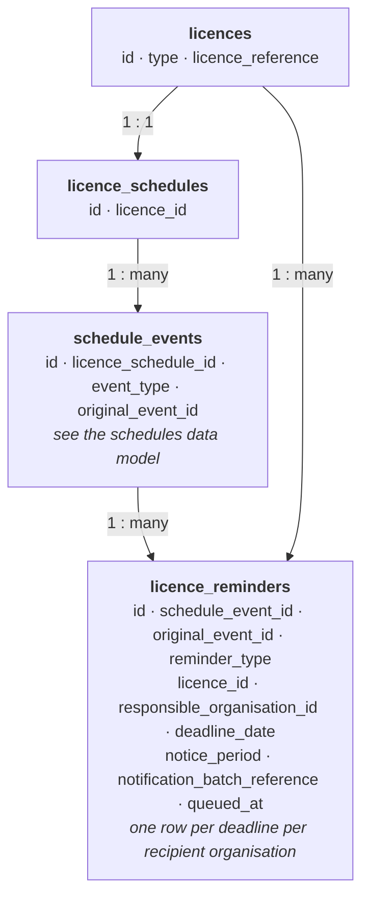

# Licence Schedule Reminders — Data Model and Sending Behaviour

How the Licensing Management Service (LMS) records the deadline reminder emails it sends to
licensees, what decides whether a reminder goes out, and the enumerated values that appear in
the data.

This document describes the *database* behaviour only. It assumes no access to the LMS
codebase. All table and column names below are the live PostgreSQL names.

Reminders are driven by the licence schedule but are not part of it. The schedule itself —
terms, phases, work programme activities, rates, expiry — is described in
`licence-schedules-data-model.md`, and the vocabulary here (schedule event, schedule version,
`original_event_id`) is that document's.

---

## 1. What this is

LMS warns licensees when a schedule deadline is approaching. A scheduled job runs, finds the
deadlines falling inside a notice window, and queues one email per recipient organisation.

`licence_reminders` is the record of what it has already sent. It exists for one operational
reason: **its rows are what stop the same reminder being sent again on the next run.** It is
not a list of upcoming deadlines, and it is not a delivery log.

| Term | Meaning |
|---|---|
| **Deadline** | A date in a schedule worth warning about — a term or phase end, a work programme activity due date, an other schedule event date, or the licence expiry date |
| **Notice window** | The period before a deadline during which the reminder should go out (§5) |
| **Batch** | The set of deadlines that went out together in a single email to a single recipient |
| **Recipient organisation** | The Energy Portal organisation responsible for the licence; the reminder goes to its submitters |

---

## 2. How it fits together

```
licences (id INTEGER)                schedule_events (id UUID, original_event_id)
        │                                     │
        │ licence_id                          │ schedule_event_id
        └──────────────┬──────────────────────┘
                       ▼
               licence_reminders
        one row per (deadline, recipient organisation) already queued
```

`licence_reminders` is a satellite of `schedule_events`, in the same sense as `event_comments`
and `work_programme_activity_statuses`: it points at an event rather than at a schedule
version, so it is unaffected when the schedule is re-versioned, and it is not copied when a
new schedule version is created.

### 2.1 Entity relationship diagram

Read top to bottom: each layer is keyed on the layer above it.



The edge from `licences` is a real foreign key, not a shortcut through the schedule: the row
records which licence the reminder was about, and for licence expiry reminders that is the
only event link there is (§4.1).

---

## 3. `licence_reminders`

```
id                           UUID PK
schedule_event_id            UUID             → schedule_events.id  (nullable)
original_event_id            UUID             (nullable)
reminder_type                TEXT NOT NULL    ← §6.1
licence_id                   INTEGER NOT NULL → licences.id
responsible_organisation_id  INTEGER NOT NULL ← Energy Portal organisation
deadline_date                DATE NOT NULL
notice_period                TEXT NOT NULL    ← §6.2
notification_batch_reference UUID NOT NULL
queued_at                    TIMESTAMPTZ NOT NULL
```

**Rows are inserted and never updated or deleted.** There is no status column and no
completion flag; the presence of a row is the whole of the state.

| Column | What it means |
|---|---|
| `schedule_event_id` | The specific schedule event row the deadline came from — one version's row, not the logical event. Set for every reminder type. |
| `original_event_id` | The logical event across schedule versions. Populated for the three event-anchored types, **null for `LICENCE_EXPIRY`** (§4.1). |
| `deadline_date` | The date being warned about |
| `queued_at` | When the job ran and the email was handed off — not the deadline, and not a delivery time |
| `notification_batch_reference` | Groups the rows that went out in one email (§3.1) |
| `responsible_organisation_id` | The organisation the reminder was addressed to. One deadline produces one row per organisation. |

### 3.1 `notification_batch_reference`

One email can cover several deadlines. All the rows written for that email share a
`notification_batch_reference`, generated fresh per batch, and a batch is one
`(recipient organisation, deadline date, reminder type)` combination.

This is the only link between a row and the message it went out in — there is no email table
in LMS. To reconstruct what a licensee actually received:

```sql
SELECT r.notification_batch_reference, r.queued_at, r.reminder_type,
       r.licence_id, r.deadline_date, r.original_event_id
FROM licence_reminders r
WHERE r.responsible_organisation_id = :org_id
ORDER BY r.queued_at DESC, r.notification_batch_reference;
```

---

## 4. What decides whether a reminder is sent

Three gates, in order. A deadline that fails any of them produces no row at all, so **the
absence of a row is not evidence that a deadline does not exist.**

1. **The deadline falls inside the notice window** — `deadline_date` is on or after today and
   on or before today plus the notice period (§5).
2. **The licence is `EXTANT`.** A licence in any other current status is skipped silently.
   Nothing is written to say it was skipped.
3. **No matching row already exists.** The job discards any deadline that already has a row
   for the same combination (§4.2).

Deadlines are read from the licence's **`ACTIVE`** schedule version only. A deadline that
exists solely in a draft is never reminded on.

### 4.1 Where each reminder type gets its deadline

| `reminder_type` | Deadline read from | `original_event_id` |
|---|---|---|
| `TERM_OR_PHASE_END` | `licence_schedule_terms.end_date` / `licence_schedule_phases.end_date` | populated |
| `WORK_PROGRAMME_ACTIVITY` | the activity's effective due date — which is `due_date` only for relative dates, and otherwise the linked term's or phase's `end_date` | populated |
| `OTHER_SCHEDULE_EVENT` | the other schedule event's effective date, resolved the same way | populated |
| `LICENCE_EXPIRY` | `licence_schedule_expiry_dates.expiry_date` | **null** |

`LICENCE_EXPIRY` is the odd one out. Its `schedule_event_id` is set like the others, but
`original_event_id` is deliberately left null, because expiry is deduplicated per licence
rather than per event — a licence has only one expiry date, so the licence is the natural key.
That single difference is why the uniqueness rules split in two below.

### 4.2 Uniqueness — two partial indexes, not one constraint

| Index | Keys on | Applies when |
|---|---|---|
| `licence_reminders_event_unique` | `original_event_id`, `responsible_organisation_id`, `notice_period`, `deadline_date` | `original_event_id IS NOT NULL` — the three event-anchored types |
| `licence_reminders_licence_unique` | `licence_id`, `reminder_type`, `responsible_organisation_id`, `notice_period`, `deadline_date` | `reminder_type = 'LICENCE_EXPIRY'` |

Neither index includes `schedule_event_id`, and that is the important part:

**A deadline that survives a schedule update is not re-reminded.** When the schedule is
re-versioned, the event is copied to a new row with a fresh id but the same
`original_event_id`, so the existing reminder row still matches and the deadline is skipped. A
second reminder goes out only if the deadline **date itself** moves, because the date is part
of the key.

The practical consequence for reporting: a licensee who was warned about a date that later
shifted will have two rows for the same logical event, with different `deadline_date` values.
That is correct behaviour, not duplication.

---

## 5. The notice window

The window is derived forwards from the day the job runs: a deadline is due for a reminder if
it falls between today and today plus the notice period.

It is worth knowing why it is defined in that direction, because it shows up in the data.
Working backwards from the deadline instead would clamp to month length — six months before
31 August does not exist, so the arithmetic lands on 28 February, and a query bounded by "28
February plus six months" only reaches 28 August and never returns the deadline. Deriving
forwards keeps the query bound and the test identical, at the cost that a deadline of 31
August is first picked up on 1 March, with a little over six months' notice rather than
exactly six.

So `queued_at` and `deadline_date` will not always sit exactly one notice period apart, and a
gap slightly larger than the notice period at month boundaries is expected.

---

## 6. Enumerated values

Both are persisted as the Java constant name in a `TEXT` column — no lookup table, no `CHECK`
constraint. The lists describe what the service writes rather than what the schema guarantees.

### 6.1 `reminder_type`

| Value | Deadline |
|---|---|
| `TERM_OR_PHASE_END` | A term or phase ending |
| `WORK_PROGRAMME_ACTIVITY` | A work programme activity falling due |
| `OTHER_SCHEDULE_EVENT` | An other schedule event falling due |
| `LICENCE_EXPIRY` | The licence expiring |

### 6.2 `notice_period`

| Value | Meaning |
|---|---|
| `SIX_MONTHS` | The reminder goes out when the deadline falls within six months of the day the job runs |

Currently the only value, and every reminder type uses it. The column exists so the notice
period can vary by type later, so do not assume a single value when querying — and note that
it is part of both uniqueness keys, so changing a type's notice period would allow a second
reminder for a deadline already warned about.

---

## 7. Audit history (Hibernate Envers)

`licence_reminders_aud` holds the same data columns plus:

- `rev` — revision number, FK to `audit_revisions.rev`
- `revtype` — `0` = insert, `1` = update, `2` = delete

Since rows are only ever inserted, the audit table is of limited use here — it duplicates what
`queued_at` already records. Revision metadata lives in the shared `audit_revisions` table
described in the schedules data model.

---

## 8. Caveats and known gotchas

1. **A row means an email was queued, not delivered or read.** Delivery happens outside LMS
   and nothing is written back. There is no bounced, failed or opened state, and a row is
   written even if delivery later fails.
2. **This is not a list of upcoming deadlines.** It only contains deadlines already warned
   about, for licences that were `EXTANT` at the moment the job ran. To find what is coming
   up, query the schedule; to find what has been warned about, query here.
3. **A licence that is not `EXTANT` leaves no trace.** Suppression is silent — there is no row
   recording that a reminder was withheld, so you cannot distinguish "suppressed" from "no
   deadline" from this table.
4. **`original_event_id` is null for expiry reminders**, so a query joining
   `licence_reminders` to `schedule_events` on `original_event_id` silently drops every
   licence expiry reminder. Join on `schedule_event_id` instead, or handle the type
   explicitly.
5. **`schedule_event_id` points at one schedule version's row.** That row may belong to a
   version that is now `REPLACED`. It still exists — schedule versions are never physically
   deleted — but it is not the current shape of that event. Use `original_event_id` to reach
   the current row, except for expiry reminders where it is null.
6. **Rows survive the event they refer to.** Deleting a work programme activity from the
   schedule does not remove reminders already sent about it, and nothing marks them as
   orphaned.
7. **Organisation identifiers are external.** `responsible_organisation_id` is an Energy
   Portal organisation id. LMS stores no name for it.

---

## 9. Reference: current columns per table

**`licence_reminders`**
`id`, `schedule_event_id`, `original_event_id`, `reminder_type`, `licence_id`,
`responsible_organisation_id`, `deadline_date`, `notice_period`,
`notification_batch_reference`, `queued_at`

Indexes beyond the primary key: `licence_reminders_batch_idx` on
`notification_batch_reference`, `licence_reminders_licence_idx` on `licence_id`, plus the two
partial unique indexes in §4.2.
