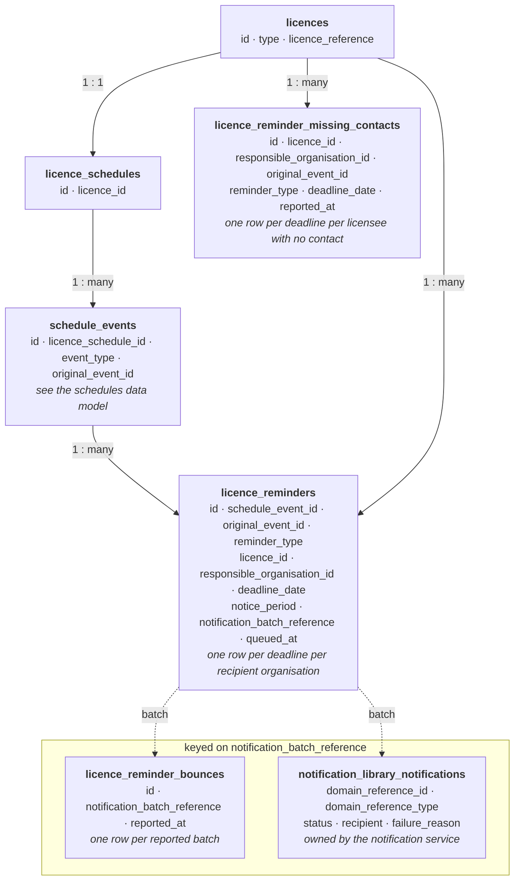

# Licence Schedule Reminders — Data Model and Sending Behaviour

How the Licensing Management Service (LMS) records the deadline reminder emails it sends to
licensees, what decides whether a reminder goes out, how reminders that could not be delivered
or could not be addressed are reported, and the enumerated values that appear in the data.

This document describes the *database* behaviour only. It assumes no access to the LMS
codebase. All table and column names below are the live PostgreSQL names.

Reminders are driven by the licence schedule but are not part of it. The schedule itself —
terms, phases, work programme activities, rates, expiry — is described in
`licence-schedules-data-model.md`, and the vocabulary here (schedule event, schedule version,
`original_event_id`) is that document's.

---

## 1. What this is

LMS warns licensees when a schedule deadline is approaching. A scheduled job runs, finds the
deadlines falling inside a notice window, and queues one email per recipient organisation.

`licence_reminders` is the record of what it has already sent. It exists for one operational
reason: **its rows are what stop the same reminder being sent again on the next run.** It is
not a list of upcoming deadlines, and it is not a delivery log.

A second job runs later the same morning, finds reminder emails that could not be delivered,
and reports them in one email to the regulator's approvals mailbox. `licence_reminder_bounces`
records which batches have already been reported, so each is reported once (§6).

A licensee with no licence contact cannot be sent a reminder at all. The reminder job reports
those gaps to the regulator's licence contacts managers instead, and
`licence_reminder_missing_contacts` records which have already been reported (§7).

| Term | Meaning |
|---|---|
| **Deadline** | A date in a schedule worth warning about — a term or phase end, a work programme activity due date, an other schedule event date, or the licence expiry date |
| **Notice window** | The period before a deadline during which the reminder should go out (§5) |
| **Batch** | The set of deadlines that went out together in a single email to a single recipient |
| **Recipient organisation** | The Energy Portal organisation responsible for the licence (the licensee); the reminder goes to that licensee's `licence_contact.contact_email` |
| **Bounce** | A reminder email that the notification service has given up trying to deliver (§6.1) |
| **Missing contact** | A due deadline on a licence where one of the licensees has no `licence_contact` row, so no reminder can be sent to it (§7) |

---

## 2. How it fits together

```
licences (id INTEGER)                schedule_events (id UUID, original_event_id)
        │                                     │
        │ licence_id                          │ schedule_event_id
        ├──────────────┬──────────────────────┘
        │              ▼
        │      licence_reminders
        │   one row per (deadline, recipient organisation) already queued
        │              ┊
        │              ┊ notification_batch_reference (no foreign key)
        │              ▼
        │  licence_reminder_bounces
        │   one row per batch already reported as undelivered
        │
        │ licence_id
        ▼
licence_reminder_missing_contacts
one row per (deadline, licensee with no contact) already reported
```

`licence_reminders` is a satellite of `schedule_events`, in the same sense as `event_comments`
and `work_programme_activity_statuses`: it points at an event rather than at a schedule
version, so it is unaffected when the schedule is re-versioned, and it is not copied when a
new schedule version is created.

### 2.1 Entity relationship diagram

Read top to bottom: each layer is keyed on the layer above it.


```mermaid
flowchart TB
    LIC["<b>licences</b><br/>id · type · licence_reference"]
    LS["<b>licence_schedules</b><br/>id · licence_id"]
    SE["<b>schedule_events</b><br/>id · licence_schedule_id · event_type · original_event_id<br/><i>see the schedules data model</i>"]
    REM["<b>licence_reminders</b><br/>id · schedule_event_id · original_event_id · reminder_type<br/>licence_id · responsible_organisation_id · deadline_date<br/>notice_period · notification_batch_reference · queued_at<br/><i>one row per deadline per recipient organisation</i>"]
    MC["<b>licence_reminder_missing_contacts</b><br/>id · licence_id · responsible_organisation_id · original_event_id<br/>reminder_type · deadline_date · reported_at<br/><i>one row per deadline per licensee with no contact</i>"]

    subgraph BATCH["keyed on notification_batch_reference"]
        direction LR
        BNC["<b>licence_reminder_bounces</b><br/>id · notification_batch_reference · reported_at<br/><i>one row per reported batch</i>"]
        NLN["<b>notification_library_notifications</b><br/>domain_reference_id · domain_reference_type<br/>status · recipient · failure_reason<br/><i>owned by the notification service</i>"]
    end

    LIC -- "1 : 1" --> LS
    LS -- "1 : many" --> SE
    SE -- "1 : many" --> REM
    LIC -- "1 : many" --> REM
    LIC -- "1 : many" --> MC
    REM -. "batch" .-> BNC
    REM -. "batch" .-> NLN
```

The edge from `licences` is a real foreign key, not a shortcut through the schedule: the row
records which licence the reminder was about, and for licence expiry reminders that is the
only event link there is (§4.1). The two dotted edges are matches on
`notification_batch_reference`, with no foreign key behind them (§6).

`licence_reminder_missing_contacts` hangs off `licences` only. It carries `original_event_id`
but has no `schedule_event_id` and no foreign key to `schedule_events` (§7).

---

## 3. `licence_reminders`

```
id                           UUID PK
schedule_event_id            UUID             → schedule_events.id  (nullable)
original_event_id            UUID             (nullable)
reminder_type                TEXT NOT NULL    ← §8.1
licence_id                   INTEGER NOT NULL → licences.id
responsible_organisation_id  INTEGER NOT NULL ← Energy Portal organisation
deadline_date                DATE NOT NULL
notice_period                TEXT NOT NULL    ← §8.2
notification_batch_reference UUID NOT NULL
queued_at                    TIMESTAMPTZ NOT NULL
```

**Rows are inserted and never updated or deleted.** There is no status column and no
completion flag; the presence of a row is the whole of the state.

| Column | What it means |
|---|---|
| `schedule_event_id` | The specific schedule event row the deadline came from — one version's row, not the logical event. Set for every reminder type. |
| `original_event_id` | The logical event across schedule versions. Populated for the three event-anchored types, **null for `LICENCE_EXPIRY`** (§4.1). |
| `deadline_date` | The date being warned about |
| `queued_at` | When the job ran and the email was handed off — not the deadline, and not a delivery time |
| `notification_batch_reference` | Groups the rows that went out in one email (§3.1) |
| `responsible_organisation_id` | The organisation the reminder was addressed to. One deadline produces one row per organisation. |

### 3.1 `notification_batch_reference`

One email can cover several deadlines. All the rows written for that email share a
`notification_batch_reference`, generated fresh per batch. A batch is one
`(licence, recipient organisation, deadline date)` combination: every deadline on that licence
falling on the same date goes out in one email to that licensee, whatever its `reminder_type`.
So a single batch can mix, say, a phase end and a work programme activity due on the same day.

This is the only link between a row and the message it went out in. The email itself is held
by the notification service in `notification_library_notifications`, whose
`domain_reference_id` is the batch reference as text (§6.1). To reconstruct what a licensee was
sent:

```sql
SELECT r.notification_batch_reference, r.queued_at, r.reminder_type,
       r.licence_id, r.deadline_date, r.original_event_id
FROM licence_reminders r
WHERE r.responsible_organisation_id = :org_id
ORDER BY r.queued_at DESC, r.notification_batch_reference;
```

---

## 4. What decides whether a reminder is sent

Three gates, in order. A deadline that fails any of them produces no row at all, so **the
absence of a row is not evidence that a deadline does not exist.**

Before any of them apply, the job only runs at all in an environment where the LMS1 release
phase is switched on. Where it is not, the job does nothing and writes no rows.

1. **The deadline falls inside the notice window** — `deadline_date` is on or after today and
   on or before today plus the notice period (§5).
2. **The licence is `EXTANT`.** A licence in any other current status is skipped silently.
   Nothing is written to say it was skipped.
3. **No matching row already exists.** The job discards any deadline that already has a row
   for the same combination (§4.2).

Deadlines are read from the licence's **`ACTIVE`** schedule version only. A deadline that
exists solely in a draft is never reminded on.

### 4.1 Where each reminder type gets its deadline

| `reminder_type` | Deadline read from | `original_event_id` |
|---|---|---|
| `TERM_OR_PHASE_END` | `licence_schedule_terms.end_date` / `licence_schedule_phases.end_date` | populated |
| `WORK_PROGRAMME_ACTIVITY` | the activity's effective due date — which is `due_date` only for relative dates, and otherwise the linked term's or phase's `end_date` | populated |
| `OTHER_SCHEDULE_EVENT` | the other schedule event's effective date, resolved the same way | populated |
| `LICENCE_EXPIRY` | `licence_schedule_expiry_dates.expiry_date` | **null** |

`LICENCE_EXPIRY` is the odd one out. Its `schedule_event_id` is set like the others, but
`original_event_id` is deliberately left null, because expiry is deduplicated per licence
rather than per event — a licence has only one expiry date, so the licence is the natural key.
That single difference is why the uniqueness rules split in two below.

### 4.2 Uniqueness — two partial indexes, not one constraint

| Index | Keys on | Applies when |
|---|---|---|
| `licence_reminders_event_unique` | `original_event_id`, `responsible_organisation_id`, `notice_period`, `deadline_date` | `original_event_id IS NOT NULL` — the three event-anchored types |
| `licence_reminders_licence_unique` | `licence_id`, `reminder_type`, `responsible_organisation_id`, `notice_period`, `deadline_date` | `reminder_type = 'LICENCE_EXPIRY'` |

Neither index includes `schedule_event_id`, and that is the important part:

**A deadline that survives a schedule update is not re-reminded.** When the schedule is
re-versioned, the event is copied to a new row with a fresh id but the same
`original_event_id`, so the existing reminder row still matches and the deadline is skipped. A
second reminder goes out only if the deadline **date itself** moves, because the date is part
of the key.

The practical consequence for reporting: a licensee who was warned about a date that later
shifted will have two rows for the same logical event, with different `deadline_date` values.
That is correct behaviour, not duplication.

---

## 5. The notice window

The window is derived forwards from the day the job runs: a deadline is due for a reminder if
it falls between today and today plus the notice period.

It is worth knowing why it is defined in that direction, because it shows up in the data.
Working backwards from the deadline instead would clamp to month length — six months before
31 August does not exist, so the arithmetic lands on 28 February, and a query bounded by "28
February plus six months" only reaches 28 August and never returns the deadline. Deriving
forwards keeps the query bound and the test identical, at the cost that a deadline of 31
August is first picked up on 1 March, with a little over six months' notice rather than
exactly six.

So `queued_at` and `deadline_date` will not always sit exactly one notice period apart, and a
gap slightly larger than the notice period at month boundaries is expected.

---

## 6. Bounces — reminders that could not be delivered

A second job runs every morning an hour after the reminder job. It looks for reminder emails
that could not be delivered and have not yet been reported, and sends one email to the
regulator's approvals mailbox listing each of them: licence reference, licensee, recipient
address, reminder type, deadline date and failure reason. Like the reminder job, it only runs
in an environment where the LMS1 release phase is switched on.

### 6.1 Where delivery status comes from

LMS does not hold the delivery status of a reminder itself. Emails are queued with a shared
notification service, which records each one in `notification_library_notifications` and
polls GOV.UK Notify for its progress. A reminder email's row there has:

| Column | Value for a reminder email |
|---|---|
| `domain_reference_type` | `LICENCE_REMINDER` |
| `domain_reference_id` | the batch's `notification_batch_reference`, as text |
| `recipient` | the address the reminder was sent to |
| `status` | the notification service's status — see below |
| `failure_reason` | why it failed, when it did |

A reminder counts as **bounced** when its `status` is `FAILED_NOT_SENT`. That is the
notification service's final "given up" status, reached in two ways:

| What GOV.UK Notify reported | Outcome |
|---|---|
| A permanent failure (for example an address that does not exist) | `FAILED_NOT_SENT` straight away |
| A temporary or technical failure | Retried; becomes `FAILED_NOT_SENT` only once the service's retry period has run out |

`failure_reason` tells the two apart. Successful delivery ends as `SENT`; an email still in
flight stays `SENT_TO_NOTIFY` until the next poll.

The bounce report email is itself held in the same table, with `domain_reference_type`
`LICENCE_REMINDER_BOUNCE` and a `domain_reference_id` that is generated for the report and
stored nowhere in LMS.

### 6.2 `licence_reminder_bounces`

```
id                           UUID PK
notification_batch_reference UUID NOT NULL  UNIQUE
reported_at                  TIMESTAMPTZ NOT NULL
```

One row per batch that has been included in a bounce report. **Its only job is to stop the
same batch being reported again**, in the same way `licence_reminders` stops a deadline being
reminded again. Rows are inserted and never updated or deleted.

| Column | What it means |
|---|---|
| `notification_batch_reference` | The batch that bounced — matches `licence_reminders.notification_batch_reference`, with no foreign key. Unique (`licence_reminder_bounces_batch_unique`), so a batch is reported at most once. |
| `reported_at` | When the bounce job ran and included the batch in its report |

A batch with several deadlines produces several lines in the report email but a single row
here. All the batches in one report share the same `reported_at`.

To list bounced reminders, including those not yet reported:

```sql
SELECT r.licence_id, r.responsible_organisation_id, r.reminder_type, r.deadline_date,
       n.recipient, n.failure_reason, b.reported_at
FROM licence_reminders r
JOIN notification_library_notifications n
  ON n.domain_reference_id = r.notification_batch_reference::text
 AND n.domain_reference_type = 'LICENCE_REMINDER'
LEFT JOIN licence_reminder_bounces b
  ON b.notification_batch_reference = r.notification_batch_reference
WHERE n.status = 'FAILED_NOT_SENT'
ORDER BY r.licence_id, r.deadline_date;
```

A null `reported_at` means the bounce has not been reported yet.

---

## 7. Missing contacts — licensees that cannot be reminded

A reminder goes to a licensee's `licence_contact.contact_email`, and a licensee has at most one
contact. When a licensee on a licence has no `licence_contact` row, there is nowhere to send
its reminder: **no `licence_reminders` row is written for it, and no email goes out.**

Instead, at the end of each reminder run, the job takes the deadlines that passed the window
and status gates (§4) and finds every licensee on those licences that has no contact. It sends
one email listing them — licence reference, licensee, reminder type and deadline date — to
every user holding the Licence contacts manager role in the regulator's licence management
team, so a contact can be added before the deadline passes.

Reporting a missing contact never affects the reminders themselves. If the report fails, the
reminders already queued in that run stand, and the failure leaves no rows in this table.

### 7.1 `licence_reminder_missing_contacts`

```
id                           UUID PK
licence_id                   INTEGER NOT NULL → licences.id
responsible_organisation_id  INTEGER NOT NULL ← Energy Portal organisation
original_event_id            UUID             (nullable)
reminder_type                TEXT NOT NULL    ← §8.1
deadline_date                DATE NOT NULL
reported_at                  TIMESTAMPTZ NOT NULL
```

One row per **(deadline, licensee with no contact)** that has been reported. Like
`licence_reminders`, **its only job is to stop the same gap being reported again on the next
run.** Rows are inserted and never updated or deleted.

| Column | What it means |
|---|---|
| `licence_id` | The licence the deadline is on |
| `responsible_organisation_id` | The licensee with no contact |
| `original_event_id` | The logical schedule event, as in `licence_reminders`. **Null for `LICENCE_EXPIRY`**, for the same reason (§4.1). |
| `reminder_type` | The kind of deadline (§8.1) |
| `deadline_date` | The date the licensee would have been warned about |
| `reported_at` | When the reminder job ran and included the gap in its report. All the gaps in one report share it. |

There is no `schedule_event_id` and no `notice_period`, unlike `licence_reminders`.

Uniqueness follows the same split as §4.2, through two partial unique indexes:

| Index | Keys on | Applies when |
|---|---|---|
| `licence_reminder_missing_contacts_event_unique` | `original_event_id`, `responsible_organisation_id`, `deadline_date` | `original_event_id IS NOT NULL` |
| `licence_reminder_missing_contacts_licence_unique` | `licence_id`, `reminder_type`, `responsible_organisation_id`, `deadline_date` | `original_event_id IS NULL` |

So, as with reminders, a gap that survives a schedule update is not reported again, but a gap
whose deadline date moves is.

### 7.2 What a row does and does not tell you

| Situation | Row here? | Row in `licence_reminders`? |
|---|---|---|
| Licensee has a contact | No | Yes, once queued |
| Licensee has no contact, and there is at least one licence contacts manager | Yes | No |
| Licensee has no contact, but **no one holds the licence contacts manager role** | **No** — nothing is written, so the gap is reported on a later run once a manager exists, provided the deadline is still inside the notice window | No |
| A contact is added after the gap was reported | The row stays | Yes, on the next run, if the deadline is still inside the notice window |
| Licence is not `EXTANT` | No | No |

A reported gap is never closed off. Whether a contact was later added has to be checked against
`licence_contact` and `licence_reminders`, not here.

---

## 8. Enumerated values

Both are persisted as the Java constant name in a `TEXT` column — no lookup table, no `CHECK`
constraint. The lists describe what the service writes rather than what the schema guarantees.
`reminder_type` takes the same values in `licence_reminders` and
`licence_reminder_missing_contacts`; `notice_period` appears only in `licence_reminders`.

### 8.1 `reminder_type`

| Value | Deadline |
|---|---|
| `TERM_OR_PHASE_END` | A term or phase ending |
| `WORK_PROGRAMME_ACTIVITY` | A work programme activity falling due |
| `OTHER_SCHEDULE_EVENT` | An other schedule event falling due |
| `LICENCE_EXPIRY` | The licence expiring |

### 8.2 `notice_period`

| Value | Meaning |
|---|---|
| `SIX_MONTHS` | The reminder goes out when the deadline falls within six months of the day the job runs |

Currently the only value, and every reminder type uses it. The column exists so the notice
period can vary by type later, so do not assume a single value when querying — and note that
it is part of both uniqueness keys, so changing a type's notice period would allow a second
reminder for a deadline already warned about.

---

## 9. Audit history (Hibernate Envers)

`licence_reminders_aud`, `licence_reminder_bounces_aud` and
`licence_reminder_missing_contacts_aud` hold the same data columns as their tables, plus:

- `rev` — revision number, FK to `audit_revisions.rev`
- `revtype` — `0` = insert, `1` = update, `2` = delete

Since rows are only ever inserted, the audit tables are of limited use here — they duplicate
what `queued_at` and `reported_at` already record. Revision metadata lives in the shared
`audit_revisions` table described in the schedules data model.

---

## 10. Caveats and known gotchas

1. **A `licence_reminders` row means an email was queued, not delivered or read.** The row is
   written before the email is sent, and is never updated afterwards. Delivery status lives
   only in the notification service's `notification_library_notifications` (§6.1), and there
   is no opened or read state anywhere.
2. **This is not a list of upcoming deadlines.** It only contains deadlines already warned
   about, for licences that were `EXTANT` at the moment the job ran. To find what is coming
   up, query the schedule; to find what has been warned about, query here.
3. **A licence that is not `EXTANT` leaves no trace.** Suppression is silent — there is no row
   recording that a reminder was withheld, so you cannot distinguish "suppressed" from "no
   deadline" from this table.
4. **`original_event_id` is null for expiry reminders**, so a query joining
   `licence_reminders` to `schedule_events` on `original_event_id` silently drops every
   licence expiry reminder. Join on `schedule_event_id` instead, or handle the type
   explicitly.
5. **`schedule_event_id` points at one schedule version's row.** That row may belong to a
   version that is now `REPLACED`. It still exists — schedule versions are never physically
   deleted — but it is not the current shape of that event. Use `original_event_id` to reach
   the current row, except for expiry reminders where it is null.
6. **Rows survive the event they refer to.** Deleting a work programme activity from the
   schedule does not remove reminders already sent about it, and nothing marks them as
   orphaned.
7. **No rows are written unless the LMS1 release phase is switched on** in that environment
   (§4). Until then the job is skipped entirely, so an empty table says nothing about the
   deadlines in the schedules.
8. **Organisation identifiers are external.** `responsible_organisation_id` is an Energy
   Portal organisation id. LMS stores no name for it.
9. **A bounce only appears once the notification service has given up.** A temporary failure
   is retried first, so an email that went out this morning may not count as bounced for some
   time. Until then it is neither in a report nor in `licence_reminder_bounces`. Do not read
   "no bounce row" as "delivered" — check `notification_library_notifications.status`, as the
   query in §6.2 does.
10. **A `licence_reminder_bounces` row means a bounce was reported, not that anyone received
    the report.** The report email goes through the same notification service and could
    itself fail. Nothing reports that failure, and the batch is still marked as reported.
11. **A licensee with no contact has no `licence_reminders` row at all.** Its due deadlines
    appear in `licence_reminder_missing_contacts` instead (§7), so a query for "who was
    reminded about this deadline" must check both tables to tell "not reminded because no
    contact" from "not due".
12. **A missing-contact row is not removed when a contact is added.** It records that the gap
    was reported, not that it is still open (§7.2).
13. **A missing contact is only recorded if someone was told.** When no user holds the licence
    contacts manager role, the gap is not reported and no row is written. It is picked up on a
    later run, but only while the deadline is still inside the notice window.

---

## 11. Reference: current columns per table

**`licence_reminders`**
`id`, `schedule_event_id`, `original_event_id`, `reminder_type`, `licence_id`,
`responsible_organisation_id`, `deadline_date`, `notice_period`,
`notification_batch_reference`, `queued_at`

Indexes beyond the primary key: `licence_reminders_batch_idx` on
`notification_batch_reference`, `licence_reminders_licence_idx` on `licence_id`, plus the two
partial unique indexes in §4.2.

**`licence_reminder_bounces`**
`id`, `notification_batch_reference`, `reported_at`

Constraints beyond the primary key: `licence_reminder_bounces_batch_unique` on
`notification_batch_reference`.

**`licence_reminder_missing_contacts`**
`id`, `licence_id`, `responsible_organisation_id`, `original_event_id`, `reminder_type`,
`deadline_date`, `reported_at`

Foreign key: `licence_reminder_missing_contacts_licence_fk` on `licence_id` → `licences.id`.
Indexes beyond the primary key: `licence_reminder_missing_contacts_licence_idx` on
`licence_id`, plus the two partial unique indexes in §7.1.
