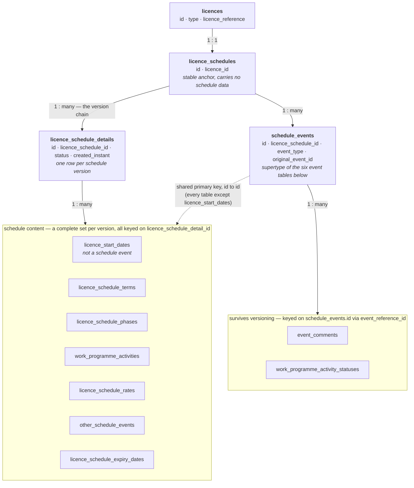

# Licence Schedules — Data Model, Creation and Update Behaviour

**Audience:** Data Warehouse team
**Scope:** How the Licensing Management Service (LMS) stores licence schedules, what happens
in the database when a schedule is created and when it is updated, and the enumerated values
that appear in the data.

This document describes the *database* behaviour only. It assumes no access to the LMS
codebase. All table and column names below are the live PostgreSQL names.

---

## 1. Vocabulary

| Term | Meaning |
|---|---|
| **Licence** | An energy licence, sourced from PEARS/the Energy Portal. Lives in `licences`. Integer PK. |
| **Schedule** | The set of commitments and dates attached to a licence — terms, phases, work programme activities, rental rates, expiry. One schedule per licence. |
| **Schedule version** (a.k.a. *schedule detail*) | A complete point-in-time snapshot of the whole schedule. A licence's schedule accumulates one row per version. Lives in `licence_schedule_details`. |
| **Schedule event** | Any dated item within a schedule version — a term, a phase, a work programme activity, a rate, an "other" event, or the expiry date. |
| **Term** | A major licence period (Initial, Second, Third; for carbon storage: Appraisal, Initial, Operational, Post Closure). |
| **Phase** | A subdivision of a term (Phase A/B/C — Initial term only). |
| **Work programme activity (WPA)** | A committed piece of work with a due date (drill a well, shoot seismic, etc.). |

The single most important structural fact: **LMS never edits a live schedule in place.
Every change produces a brand-new set of rows for the entire schedule.** Section 5 explains
the consequences for reporting.

---

## 2. The three-layer structure

```
licences (id INTEGER)
   │  1 : 1
   ▼
licence_schedules (id UUID, licence_id)
   │  1 : many  ← one row per *version* of the schedule
   ▼
licence_schedule_details (id UUID, licence_schedule_id, status, created_instant)
   │  1 : many  ← the actual content, re-created per version
   ▼
licence_start_dates, licence_schedule_terms, licence_schedule_phases,
work_programme_activities, licence_schedule_rates, other_schedule_events,
licence_schedule_expiry_dates
```

- `licence_schedules` is a thin stable anchor. It exists so that things which must outlive
  an individual version — event comments and work programme activity statuses (§6) — have
  something permanent to point at. It carries no data beyond `licence_id`. A licence has
  **at most one** row here; this is enforced in application code, not by a database unique
  constraint.
- `licence_schedules.licence_id` is the join key back to `licences`. `licences` also carries
  `type`, `subtype`, `prefix`, `licence_number`, `licence_reference`, `responsible_team`,
  `end_date`.
- `licence_schedule_details` is the version table. Its `status` column drives everything
  (see section 4).
- Every child table carries `licence_schedule_detail_id` — i.e. child rows belong to **one
  specific version**, never to the schedule as a whole.

### 2.1 Entity relationship diagram

Read top to bottom: each layer is keyed on the layer above it.



The diagram deliberately omits the foreign keys *within* the content layer, which would
obscure the top-down shape. They are:

| From | To | Column |
|---|---|---|
| `licence_schedule_phases` | `licence_schedule_terms` | `licence_schedule_term_id` (parent term) |
| `work_programme_activities` | `licence_schedule_terms` / `licence_schedule_phases` | `licence_schedule_term_id` / `licence_schedule_phase_id` |
| `licence_schedule_rates` | `licence_schedule_terms` / `licence_schedule_phases` | `licence_schedule_term_id` / `licence_schedule_phase_id` |
| `other_schedule_events` | `licence_schedule_terms` / `licence_schedule_phases` | `licence_schedule_term_id` / `licence_schedule_phase_id` |

In all four cases the target row belongs to the **same schedule version** as the source row —
these references never cross between versions (§5.2).

---

## 3. `schedule_events` — the shared supertype table

This is the part most likely to trip up a query written from table names alone.

Five of the six schedule event types plus expiry are stored using **joined-table
inheritance**. There is a parent table, `schedule_events`, and each event type has its own
child table. The child table's `id` is **both its primary key and a foreign key to
`schedule_events.id`** — the two rows share the same UUID.

```
schedule_events
  id                  UUID PK
  licence_schedule_id UUID NOT NULL  → licence_schedules.id
  event_type          TEXT NOT NULL  ← discriminator, see §7.2
  original_event_id   UUID NOT NULL  ← see §5.2
```

To get a complete term you must join both tables:

```sql
SELECT se.event_type, se.original_event_id, t.*
FROM licence_schedule_terms t
JOIN schedule_events se ON se.id = t.id
WHERE t.licence_schedule_detail_id = :detail_id;
```

`schedule_events` holds one row per child row **per version**. Duplicating a schedule
version duplicates the `schedule_events` rows too, each with a fresh `id`.

Notes:

- `licence_start_dates` is **not** part of this hierarchy — it has no `schedule_events` row.
- `event_type` is redundant with "which child table holds the row", but it is populated and
  reliable, so it is safe to use for filtering `schedule_events` without joining out.
- The child tables have **no separate foreign key column** to `schedule_events` — the link is
  `id` to `id`. The two *satellite* tables (§6) do have an explicit foreign key column, and it
  is named `event_reference_id`, pointing at `schedule_events.id`.

---

## 4. Schedule version status — `licence_schedule_details.status`

Stored as `TEXT`. Values:

| Value | Meaning |
|---|---|
| `DRAFT` | Being built or edited. Not visible as the licence's schedule. Only one draft is expected per licence at a time. |
| `ACTIVE` | The current, live schedule for the licence. **At most one per licence** — enforced in application code, not by a database constraint. |
| `REPLACED` | A previously active version, superseded by a newer one. Retained for history. |
| `DELETED` | A draft that was abandoned. **The rows are not physically deleted** — the status is flipped and everything stays in place. |

**For any "what is the schedule right now" query, filter to `status = 'ACTIVE'`.**
For "what did the schedule look like historically", `REPLACED` rows plus `created_instant`
give you the version chain. `DRAFT` and `DELETED` must be excluded from published reporting —
`DRAFT` is unapproved work in progress and `DELETED` is abandoned work.

### Status transitions

```
                       (user starts a new schedule)
                                  │
                                  ▼
                               DRAFT ──── abandon ────► DELETED
                                  │
                              apply
                                  │
                                  ▼
   previous ACTIVE ──► REPLACED  ACTIVE
```

---

## 5. Creation and update, step by step

### 5.1 Creating a schedule for the first time

Triggered when a Licence Management user starts the "Create a new licence schedule" journey
and submits the licence start date. In database terms:

1. A `licence_schedules` row is created for the licence if one does not already exist
   (`licence_id` set, nothing else).
2. A `licence_schedule_details` row is inserted with `status = 'DRAFT'` and
   `created_instant = now()`.
3. A `licence_start_dates` row is inserted against that detail, holding the licence start date.
4. The user then adds terms, phases, work programme activities, rates and other events one at
   a time. Each add/edit/delete writes to the relevant child table (plus a `schedule_events`
   row for the event types listed in §3) and **immediately triggers a full recalculation of
   all derived dates for that version** (§5.4).
5. When the user chooses "Apply", the detail's `status` moves `DRAFT → ACTIVE`. Because there
   was no prior active version, nothing is set to `REPLACED`.

There is no separate "applied" timestamp — see the caveats in §10.

### 5.2 Updating an existing schedule — copy, edit, apply

LMS has no in-place edit path for a live schedule. An update is:

1. **Copy.** The user starts "Update an existing licence schedule". The system takes the
   current `ACTIVE` detail and creates a **new** `licence_schedule_details` row with
   `status = 'DRAFT'`, `created_instant = now()`, pointing at the same `licence_schedule_id`.
2. Every child row of the old detail is **copied field-for-field** into new rows attached to
   the new detail. This applies to all seven child tables: `licence_start_dates`,
   `licence_schedule_terms`, `licence_schedule_phases`, `work_programme_activities`,
   `licence_schedule_rates`, `other_schedule_events`, `licence_schedule_expiry_dates`.
   - Every copied row gets a **new `id`**. All other columns — including
     `licence_schedule_id` and `original_event_id` — are carried over unchanged.
   - Internal cross-references are then re-pointed: a copied phase's
     `licence_schedule_term_id` is rewritten to the *new* term row, matched by `term_type`.
     The same re-pointing happens for rates, work programme activities and other events
     (matched on `term_type` / `phase_type`).
3. **Edit.** The user changes the new draft. Adds insert rows; edits update rows in place
   *within the draft*; deletes physically `DELETE` rows from the draft's child tables.
   The old `ACTIVE` version is untouched throughout.
4. **Apply.** On apply:
   - the previous `ACTIVE` detail is set to `REPLACED`;
   - the draft detail is set to `ACTIVE`;
   - any `PENDING` event comments on this schedule are promoted to `PUBLISHED` (§6.1).

**Tracking one logical event across versions: `original_event_id`.**
Because each version gets fresh `id`s, `schedule_events.id` cannot be used to follow "the
same" activity through time. `schedule_events.original_event_id` exists for exactly that.
On first insert it is set equal to the row's own `id`; on every subsequent copy it is carried
across untouched. So all versions of one logical schedule event share one
`original_event_id`, and the *earliest* version of that event has `id = original_event_id`.

```sql
-- Follow one work programme activity through every schedule version
SELECT lsd.status, lsd.created_instant, wpa.category, wpa.commitment, wpa.due_date
FROM work_programme_activities wpa
JOIN schedule_events se ON se.id = wpa.id
JOIN licence_schedule_details lsd ON lsd.id = wpa.licence_schedule_detail_id
WHERE se.original_event_id = :original_event_id
ORDER BY lsd.created_instant;
```

Caveat: an event that was *added* in a later version has no row in earlier versions, and one
that was *deleted* in a later version has no row in later ones. `original_event_id` groups
rows; it does not guarantee one row per version.

### 5.3 Deleting a draft

The draft detail is set to `status = 'DELETED'`. Its child rows remain in place. Pending
comments for that schedule are removed. Nothing is physically deleted except the child rows
the user explicitly deleted while editing.

### 5.4 Derived dates — what is stored versus what is calculated

Dates are **recalculated and re-persisted for the entire version** on every single add, edit
or delete within a draft, and again immediately after a version is copied. The rules:

| Table / column | How it is derived |
|---|---|
| `licence_schedule_terms.start_date` | First term starts on `licence_start_dates.start_date`. Each subsequent term (ordered by `term_type`) starts the day after the previous term's `end_date`. |
| `licence_schedule_terms.end_date` | `start_date` + `term_duration_years`/`_months`/`_days`. If years or months are non-zero, one day is subtracted (so a "5 year" term runs to the day before the fifth anniversary). Pure-day durations are not adjusted. |
| `licence_schedule_phases.start_date` / `end_date` | Same arithmetic, chained within the parent term, starting at the term's `start_date`. |
| `work_programme_activities.due_date` | **Only populated when `date_option = 'RELATIVE_DATE'`** (= anchor date + `relative_duration_*`). For `WITHIN_A_TERM` / `WITHIN_A_PHASE` the column is left null and the effective due date is the linked term's or phase's `end_date`. |
| `other_schedule_events.event_date` | Same rule as `due_date` above — only populated for `date_option = 'RELATIVE_DATE'`. |
| `licence_schedule_rates.start_date` | `TERM` → the term's start date. `PHASE` → the phase's start date. `CUSTOM_PERIOD` → the anchor's start date (`ON_START_DATE`) or anchor + `relative_duration_*` (`RELATIVE_TO_START_DATE`). |
| `licence_schedule_rates` end date | **Not stored.** Derived at display time from the start date of the next rate in the ordered sequence. |
| `licence_schedule_expiry_dates.expiry_date` | Entered by the user, not calculated. |

**Reporting consequence:** an activity's due date cannot be read from `due_date` alone. Use:

```sql
COALESCE(
  wpa.due_date,   -- RELATIVE_DATE
  ph.end_date,    -- WITHIN_A_PHASE
  tm.end_date     -- WITHIN_A_TERM
) AS effective_due_date
```

with left joins to `licence_schedule_phases ph` and `licence_schedule_terms tm`.

"Current term/phase" is evaluated as `start_date <= today AND end_date > today` — **start
inclusive, end exclusive**.

---

## 6. Data that deliberately survives versioning

Two tables hang off `schedule_events` rather than off a schedule version, so their history is
not lost when a new version is created. **Neither is copied during versioning.**

### 6.1 `event_comments`

```
id                 UUID PK
event_reference_id UUID NOT NULL  → schedule_events.id
comment            TEXT
status             TEXT           ← PENDING | PUBLISHED
timestamp          TIMESTAMPTZ
author_wua_id      INTEGER        ← Energy Portal web user account id
```

- `PENDING` — a comment written against a draft, not yet visible on the licence. Promoted to
  `PUBLISHED` when the draft is applied; hard-deleted if the draft is deleted.
- `PUBLISHED` — visible. Comments added directly against a live schedule are inserted as
  `PUBLISHED`.
- A comment points at one specific `schedule_events` row, i.e. one version. To assemble the
  full comment history for a logical event, group by `original_event_id`:

```sql
SELECT se.original_event_id, ec.timestamp, ec.author_wua_id, ec.comment
FROM event_comments ec
JOIN schedule_events se ON se.id = ec.event_reference_id
WHERE ec.status = 'PUBLISHED' AND se.licence_schedule_id = :licence_schedule_id
ORDER BY se.original_event_id, ec.timestamp;
```

- Only one `PENDING` comment per `original_event_id` is possible at a time.
- `author_wua_id` is an external Energy Portal identifier. Names are not stored in LMS — they
  are resolved from the Energy Portal at render time. Any warehouse extract needing author
  names must resolve `wua_id` from the Portal.

### 6.2 `work_programme_activity_statuses`

```
id                     UUID PK
event_reference_id     UUID NOT NULL  → schedule_events.id
status                 TEXT           ← see §7.7
applied_datetime       TIMESTAMPTZ
licence_transferred_to INTEGER        → licences.id (nullable)
```

**This is an append-only status ledger, not a current-state column.** A new row is inserted
on every status change; nothing is updated. The current status of an activity is the row with
the greatest `applied_datetime` for that activity's `original_event_id`:

```sql
SELECT DISTINCT ON (se.original_event_id)
       se.original_event_id, s.status, s.applied_datetime, s.licence_transferred_to
FROM work_programme_activity_statuses s
JOIN schedule_events se ON se.id = s.event_reference_id
ORDER BY se.original_event_id, s.applied_datetime DESC;
```

- Every new work programme activity gets an initial `OPEN` row on creation, unless a status
  row already exists for its `original_event_id` (which is the case for a copied activity —
  the existing ledger is simply reused).
- `licence_transferred_to` is populated only for the `TRANSFERRED` status, naming the licence
  the commitment moved to.
- Deleting a work programme activity from a draft removes the status ledger **only if that
  was the last remaining row with that `original_event_id`** across all versions.

---

## 7. Enumerated values

All enums are persisted as their **Java constant name in a `TEXT` column** — no numeric codes,
no lookup tables, no database `CHECK` constraints or `ENUM` types. The display strings below
are what LMS shows in its own UI; they are held in code and are **not** present in the
database. There is nothing at the database level preventing an unexpected value, so a
warehouse load should treat unknown values as a data-quality signal rather than assume the
list is enforced.

### 7.1 `licence_schedule_details.status`

`DRAFT`, `ACTIVE`, `REPLACED`, `DELETED` — see §4.

### 7.2 `schedule_events.event_type`

| Value | Child table |
|---|---|
| `TERM` | `licence_schedule_terms` |
| `PHASE` | `licence_schedule_phases` |
| `WORK_PROGRAMME_ACTIVITY` | `work_programme_activities` |
| `RATE` | `licence_schedule_rates` |
| `OTHER` | `other_schedule_events` |
| `EXPIRY` | `licence_schedule_expiry_dates` |

### 7.3 `licence_schedule_terms.term_type`

| Value | Display | Applies to licence types |
|---|---|---|
| `INITIAL` | Initial Term | Landward production, Seaward production |
| `SECOND` | Second Term | Landward production, Seaward production |
| `THIRD` | Third Term | Landward production, Seaward production |
| `APPRAISAL` | Appraisal Term | Carbon storage |
| `OPERATIONAL` | Operational Term | Carbon storage |
| `POST_CLOSURE_PERIOD` | Post Closure Period | Carbon storage |
| `INITIAL_CS` | Initial Term | Carbon storage — **historic data only**, see below |

**Term sequences.** Terms are ordered by a fixed rank held against each value, not by any
column in the database. The live sequences are:

- **Production** (landward and seaward): Initial → Second → Third
- **Carbon storage**: Appraisal → Operational → Post Closure Period

**`INITIAL_CS` is not part of the current carbon storage sequence.** It exists to carry
carbon storage term data that originated as an "Initial" term in the source records, and is
only found on those schedules. Do not model it as a stage every carbon storage licence passes
through.

Critically, **`INITIAL_CS` appears *in place of* the Appraisal term, not in addition to it.**
A carbon storage schedule has one first term or the other, never both. So the two shapes a
carbon storage schedule can take are:

- Appraisal → Operational → Post Closure Period
- Initial → Operational → Post Closure Period  *(where `INITIAL_CS` is present)*

`INITIAL_CS` ranks after `APPRAISAL` and before `OPERATIONAL`, so ordering terms by rank
resolves either shape correctly without special handling — the Appraisal rank is simply
unoccupied on the schedules that use `INITIAL_CS`.

A useful assertion for a warehouse load: every carbon storage schedule version should have
exactly one of `APPRAISAL` or `INITIAL_CS`, and a version carrying both is malformed.

Note also that `INITIAL` and `INITIAL_CS` share the display text "Initial Term" but are
distinct values belonging to different licence families, so do not join or group on the
display text. `INITIAL_CS` also remains a selectable term option for carbon storage licences
rather than being blocked at the point of entry; which schedules legitimately use it is for
the NSTA to manage.

### 7.4 `licence_schedule_phases.phase_type`

| Value | Display | Parent term |
|---|---|---|
| `PHASE_A` | Phase A | `INITIAL` |
| `PHASE_B` | Phase B | `INITIAL` |
| `PHASE_C` | Phase C | `INITIAL` |

Phases exist only within the Initial term. Any phase found under another term is anomalous.

### 7.5 `work_programme_activities.category`

| Value | Display | Applies to licence types |
|---|---|---|
| `ASSESS_PRE_FEED_PLAN` | Assess pre feed plan | Carbon storage |
| `DRILLING_WELL` | Drilling Well | Carbon storage |
| `DRILL_OR_DROP_WELL` | Drill or drop well | Seaward / Landward production |
| `DRILL_WELL` | Drill well | Seaward / Landward production |
| `EARLY_RISK_ASSESSMENT` | Early risk assessment | Carbon storage |
| `EARLY_RISK_ASSESSMENT_FURTHER_MEASURES` | Early risk assessment further measures | Carbon storage |
| `EARLY_RISK_ASSESSMENT_WORKSHOP` | Early risk assessment workshop | Carbon storage |
| `END_ASSESS_PHASE_REVIEW` | End assess phase review | Carbon storage |
| `END_DEFINE_PHASE_REVIEW` | End define phase review | Carbon storage |
| `NEW_SHOOT_2_D_SEISMIC_DATA` | New shoot 2D seismic data | Seaward / Landward production |
| `NEW_SHOOT_3_D_SEISMIC_DATA` | New shoot 3D seismic data | Seaward / Landward production |
| `OBTAIN_EXISTING_2_D_SEISMIC_DATA` | Obtain existing 2D seismic data | Seaward / Landward production |
| `OBTAIN_EXISTING_3_D_SEISMIC_DATA` | Obtain existing 3D seismic data | Seaward / Landward production |
| `REPROCESS_SEISMIC_DATA` | Reprocess seismic data | Seaward / Landward production |
| `SEISMIC_ACQUISITION_AND_PROCESSING` | Seismic acquisition and processing | Carbon storage |
| `SEISMIC_REPROCESSING_AND_INTERPRETATION` | Seismic reprocessing and interpretation | Carbon storage |
| `SITE_CHARACTERISATION_REVIEW_REPORT` | Site characterisation review report | Carbon storage |
| `STORAGE_PERMIT_APPLICATION` | Storage permit application | Carbon storage |
| `WELL_INVESTMENT_ENGAGEMENT` | Well investment engagement | Carbon storage, Seaward / Landward production |
| `WELL_TEST` | Well test | Carbon storage, Seaward / Landward production |
| `OTHER_ACTIVITY` | Other activity | Carbon storage, Seaward / Landward production, Gas storage |

When `category = 'OTHER_ACTIVITY'`, the user-entered free-text name is in
`other_category_name` and **that** is the label used in the UI. For all other categories
`other_category_name` should be null. So:

```sql
CASE WHEN wpa.category = 'OTHER_ACTIVITY'
     THEN wpa.other_category_name
     ELSE wpa.category
END AS activity_label
```

### 7.6 `work_programme_activities.commitment`

| Value | Display |
|---|---|
| `FIRM` | Firm |
| `CONTINGENT` | Contingent |
| `CONDITIONAL` | Conditional |

### 7.7 `work_programme_activity_statuses.status`

| Value | Display |
|---|---|
| `OPEN` | Open |
| `IN_PROGRESS` | In progress |
| `COMPLETE` | Complete |
| `FULL_WAIVER` | Full waiver |
| `TRANSFERRED` | Transferred |

### 7.8 `work_programme_activities.date_option` and `other_schedule_events.date_option`

Both columns use the same value set.

| Value | Display | Effect on the row |
|---|---|---|
| `WITHIN_A_TERM` | Within a licence term | `licence_schedule_term_id` set, `licence_schedule_phase_id` null, date column null |
| `WITHIN_A_PHASE` | Within a licence phase | `licence_schedule_phase_id` set, `licence_schedule_term_id` null, date column null |
| `RELATIVE_DATE` | A date relative to another schedule event | Anchored to a term or phase, `relative_duration_*` populated, date column calculated and stored |

### 7.9 `licence_schedule_rates.rate_definition_option`

| Value | Display | Effect on the row |
|---|---|---|
| `TERM` | Term | `licence_schedule_term_id` set; `start_date` = term start |
| `PHASE` | Phase | `licence_schedule_phase_id` set; `start_date` = phase start |
| `CUSTOM_PERIOD` | Custom period relative to another schedule event | `rate_relative_date_option` and `relative_duration_*` used to derive `start_date` |

### 7.10 `licence_schedule_rates.rate_relative_date_option`

| Value | Display |
|---|---|
| `ON_START_DATE` | On the date of the event |
| `RELATIVE_TO_START_DATE` | On a date relative to the event |

Populated only when `rate_definition_option = 'CUSTOM_PERIOD'`.

### 7.11 `other_schedule_events.category`

| Value | Display | Applies to licence types |
|---|---|---|
| `MANDATORY_RELINQUISHMENT` | Mandatory relinquishment | Carbon storage, Seaward / Landward production, Gas storage |
| `OTHER_ACTIVITY` | Other activity | Carbon storage, Seaward / Landward production, Gas storage |

Same `other_category_name` rule as §7.5.

### 7.12 `event_comments.status`

| Value | Meaning |
|---|---|
| `PENDING` | Written against a draft; not yet visible on the licence |
| `PUBLISHED` | Visible |

### 7.13 `licences.type`

Included because it drives which of the above values are legitimate for a given schedule.

| Value | Display | Reference prefix | Managed in LMS |
|---|---|---|---|
| `CARBON_STORAGE` | Carbon storage | `CS` | Yes |
| `GAS_STORAGE` | Gas storage | `GS` | Yes |
| `LANDWARD_EXPLORATION` | Landward exploration | `LX` | Yes |
| `LANDWARD_PRODUCTION` | Landward production | `PEDL` | No |
| `METHANE_DRAINAGE` | Methane drainage | `MDL` | Yes |
| `SEAWARD_EXPLORATION` | Seaward exploration | `E` | Yes |
| `SEAWARD_PRODUCTION` | Seaward production | `P` | No |
| `A`, `AL`, `B`, `CE`, `DL`, `NA`, `XL` | *(no display name)* | as per value | No |

The last group are licence types received from PEARS that LMS does not map or manage, and they
have no display name. Treat them as "type unknown" rather than as meaningful categories.

---

## 8. Duration columns

Terms, phases, work programme activities, rates and other events all store durations as
**three separate integer columns**, not as an interval:

| Table | Columns |
|---|---|
| `licence_schedule_terms` | `term_duration_years`, `term_duration_months`, `term_duration_days` |
| `licence_schedule_phases` | `phase_duration_years`, `phase_duration_months`, `phase_duration_days` |
| `work_programme_activities` | `relative_duration_years`, `relative_duration_months`, `relative_duration_days` |
| `licence_schedule_rates` | `relative_duration_years`, `relative_duration_months`, `relative_duration_days` |
| `other_schedule_events` | `relative_duration_years`, `relative_duration_months`, `relative_duration_days` |

These are calendar durations, not fixed day counts, so they cannot be flattened to a single
number of days without losing meaning. Any component may be zero or null. The `relative_*`
columns are only meaningful when the row's `date_option` / `rate_relative_date_option` calls
for them.

---

## 9. Audit history (Hibernate Envers)

Every schedule table has a parallel audit table with the suffix `_aud`
(`licence_schedule_details_aud`, `licence_schedule_terms_aud`, `schedule_events_aud`,
`work_programme_activities_aud`, and so on). Each holds the same data columns plus:

- `rev` — revision number, FK to `audit_revisions.rev`
- `revtype` — `0` = insert, `1` = update, `2` = delete

Revision metadata lives in one shared table:

```
audit_revisions
  rev               SERIAL PK
  created_date_time TIMESTAMPTZ
  user_wua_id       BIGINT      ← who made the change (Energy Portal wua id)
  proxy_user_wua_id BIGINT      ← set when acting on behalf of another user
```

This is the **only** place that records *when* a schedule version changed status and *who*
did it. To find when a version went live:

```sql
SELECT ar.created_date_time, ar.user_wua_id, d.status
FROM licence_schedule_details_aud d
JOIN audit_revisions ar ON ar.rev = d.rev
WHERE d.id = :detail_id
ORDER BY d.rev;
```

---

## 10. Caveats and known gotchas

1. **`created_instant` is not an applied date.** `licence_schedule_details.created_instant` is
   set when the *draft* is created, not when it is applied. The LMS UI labels it "Applied
   date" in the schedule history dropdown; that label is misleading. For a genuine applied
   timestamp, use `audit_revisions.created_date_time` for the revision where `status` became
   `ACTIVE` (§9). The gap between the two can be days or weeks.
2. **"At most one `ACTIVE` per licence" is not a database constraint.** It is enforced only in
   application code. A warehouse load should assert it rather than assume it.
3. **The individual event tables carry no status column.** `licence_schedule_terms`,
   `licence_schedule_phases`, `work_programme_activities`, `licence_schedule_rates` and
   `other_schedule_events` have no per-row status. The only event-level status in the model is
   the `work_programme_activity_statuses` ledger (§6.2), and it covers work programme
   activities only. Everything else takes its state from its parent
   `licence_schedule_details.status`.
4. **Commentary lives in `event_comments`, with one exception.** The event tables have no
   `comments` column, except `licence_schedule_expiry_dates.comments`, which holds free text
   entered alongside the expiry date. All other schedule commentary is in `event_comments`
   (§6.1).
5. **Row counts grow with every schedule change, not with every changed field.** A single
   correction to one activity's due date produces a complete new copy of every term, phase,
   activity, rate and event for that licence. Volume growth is driven by number of *schedule
   updates*, multiplied by schedule size.
6. **Deletes within a draft are physical.** If an activity is removed while a schedule is being
   updated, there is no tombstone in the child table — the row simply does not exist in the new
   version. Its absence relative to the previous version is the only evidence, plus the
   `_aud` table.
7. **`DELETED` versions are dead weight, not history.** They represent abandoned drafts that
   were never live. Exclude them; do not present them as a past state of the licence.
8. **User identifiers are external.** `author_wua_id`, `user_wua_id` and `proxy_user_wua_id` are
   Energy Portal web user account ids. LMS stores no names or email addresses for them.

---

## 11. Reference: current columns per table

Schedule event tables — remember each also joins to `schedule_events` on `id` for
`licence_schedule_id`, `event_type` and `original_event_id`.

**`licence_schedule_details`**
`id`, `licence_schedule_id`, `status`, `created_instant`

**`licence_start_dates`** *(not a schedule event)*
`id`, `licence_schedule_detail_id`, `start_date`

**`licence_schedule_terms`**
`id`, `licence_schedule_detail_id`, `term_type`, `term_duration_days`, `term_duration_months`,
`term_duration_years`, `start_date`, `end_date`

**`licence_schedule_phases`**
`id`, `licence_schedule_detail_id`, `licence_schedule_term_id`, `phase_type`,
`phase_duration_days`, `phase_duration_months`, `phase_duration_years`, `start_date`, `end_date`

**`work_programme_activities`**
`id`, `licence_schedule_detail_id`, `category`, `other_category_name`, `description`,
`commitment`, `date_option`, `licence_schedule_term_id`, `licence_schedule_phase_id`,
`relative_duration_days`, `relative_duration_months`, `relative_duration_years`, `due_date`

**`licence_schedule_rates`**
`id`, `licence_schedule_detail_id`, `rate_definition_option`, `licence_schedule_term_id`,
`licence_schedule_phase_id`, `rate_relative_date_option`, `relative_duration_days`,
`relative_duration_months`, `relative_duration_years`, `start_date`, `rental_rate`

**`other_schedule_events`**
`id`, `licence_schedule_detail_id`, `category`, `other_category_name`, `description`,
`date_option`, `licence_schedule_term_id`, `licence_schedule_phase_id`,
`relative_duration_days`, `relative_duration_months`, `relative_duration_years`, `event_date`

**`licence_schedule_expiry_dates`**
`id`, `licence_schedule_detail_id`, `expiry_date`, `comments`

**`schedule_events`**
`id`, `licence_schedule_id`, `event_type`, `original_event_id`

**`event_comments`**
`id`, `event_reference_id`, `comment`, `status`, `timestamp`, `author_wua_id`

**`work_programme_activity_statuses`**
`id`, `event_reference_id`, `status`, `applied_datetime`, `licence_transferred_to`
