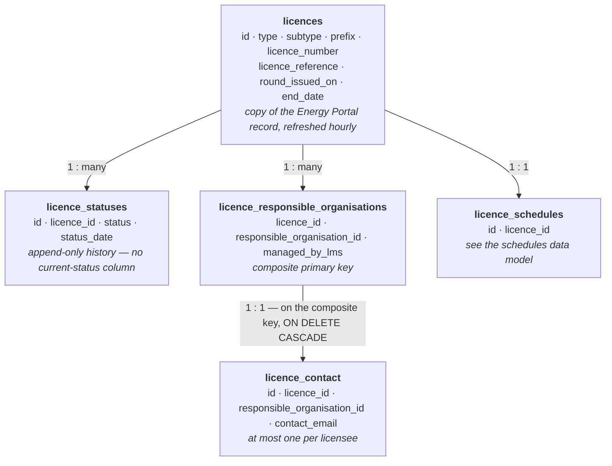

# Licences and Responsible Organisations — Data Model and Refresh Behaviour

How the Licensing Management Service (LMS) stores the licence record itself, its status
history, the organisations responsible for it and their contact addresses — and how much of
that is LMS's own data versus a copy of the Energy Portal's.

This document describes the *database* behaviour only. It assumes no access to the LMS
codebase. All table and column names below are the live PostgreSQL names.

Everything else in LMS hangs off `licences`. The schedule attached to a licence is described
in `licence-schedules-data-model.md`; applications against that schedule in
`licence-applications-data-model.md`.

**Not covered here:** licence positions, transactions and corrections — the equity and
position-tracking domain — which are a separate area with their own tables
(`licence_positions`, `licence_position_changes`, `licence_transactions`,
`licence_corrections`) and are not yet documented.

---

## 1. Vocabulary

| Term | Meaning |
|---|---|
| **Licence** | An energy licence. The record originates in PEARS / the Energy Portal, not in LMS. Lives in `licences`. |
| **PEARS** | The Energy Portal system that owns licence records. LMS holds a copy, refreshed hourly (§6). |
| **Responsible organisation** | An organisation responsible for a licence — the licensee. Held as a link row in `licence_responsible_organisations`, keyed by an Energy Portal organisation id. |
| **Licensee** | The same thing, and the word the service tends to use in its own interfaces. |
| **Status** | Whether a licence is extant, revoked, surrendered, expired or split and terminated. Held as a history in `licence_statuses`, never as a column. |
| **LMS-managed** | A responsible organisation maintained inside LMS rather than sourced from PEARS (§5.1). The distinction decides what the hourly refresh is allowed to delete. |

Two facts govern everything below:

1. **`licences.id` is not LMS's identifier.** It is the Energy Portal's licence id, supplied
   with the record. LMS never generates one.
2. **The licence record is a copy that is overwritten hourly.** Anything LMS needs to add to a
   licence lives in a separate table, because a column on `licences` would be flattened by the
   next refresh.

---

## 2. How the tables fit together

```
                        licences (id INTEGER — the Energy Portal's id)
                                   │
        ┌──────────────────────────┼──────────────────────────┐
        │ 1 : many                 │ 1 : many                 │ 1 : many
        ▼                          ▼                          ▼
licence_statuses          licence_responsible_        licence_schedules
(status history)          organisations               (see the schedules
        │                          │                   data model)
        │                          │ 1 : 1
        │                          ▼
        │                  licence_contact
        └── current status = the row with the latest status_date
```

`licences` is the only table in this document with a single-column primary key. The
responsible organisation link uses a **composite primary key** of `(licence_id,
responsible_organisation_id)`, and `licence_contact` points at that pair rather than at either
column alone.

### 2.1 Entity relationship diagram

Read top to bottom: each layer is keyed on the layer above it.



---

## 3. `licences`

```
id                INTEGER PK   ← the Energy Portal's licence id, never generated by LMS
type              TEXT NOT NULL ← §7.1
subtype           TEXT          ← §7.2
prefix            TEXT
licence_number    TEXT
licence_reference TEXT
round_issued_on   TEXT
end_date          DATE
```

`prefix` and `licence_number` are the parts; `licence_reference` is the whole reference as it
is displayed. They are stored separately rather than derived, so a licence whose reference does
not equal its prefix plus its number is a data-quality signal.

`round_issued_on` is free text describing the licensing round the licence was issued in. It is
only shown for landward and seaward production licences; on other types expect it null or
meaningless.

### 3.1 There is no row for a licence LMS has never seen

`licences` holds only what the refresh has retrieved (§6). It is not a complete register of
every licence that has ever existed, and the absence of a row means "not retrieved", not
"does not exist".

---

## 4. `licence_statuses`

```
id          UUID PK
licence_id  INTEGER NOT NULL → licences.id
status      TEXT NOT NULL    ← §7.3
status_date DATE NOT NULL
```

**This is an append-only history, not a current-state table.** There is no "current" flag. The
current status of a licence is the row with the greatest `status_date`:

```sql
SELECT DISTINCT ON (s.licence_id)
       s.licence_id, s.status, s.status_date
FROM licence_statuses s
ORDER BY s.licence_id, s.status_date DESC;
```

- **A row is written only when the status changes** — when the licence is first retrieved, and
  thereafter only when the incoming status differs from the latest recorded one. Consecutive
  refreshes that see no change write nothing, so the table is a list of transitions rather than
  a log of observations.
- **`status_date` is the date the change was observed by LMS**, taken from the clock at refresh
  time — not a date supplied by the Energy Portal. It answers "when did LMS first see this
  status", which can be up to an hour later than the real change and, for anything that
  happened before LMS existed, much later. Data loaded by the carbon storage migration is the
  exception: those rows carry a date supplied by the migration.
- **A licence with no rows has no status at all**, and reads as null rather than as extant.
  This is possible for licences loaded by a route other than the refresh.
- `status_date` is a `DATE`, not a timestamp. Two changes on the same day are indistinguishable
  by date, and ordering between them is not recoverable from this table — use the audit tables
  (§8) if that matters.

**`EXTANT` is load-bearing elsewhere.** Deadline reminders are suppressed for any licence whose
current status is not `EXTANT` (see `licence-schedule-reminders-data-model.md`), so a status
change silently stops reminders going out.

---

## 5. `licence_responsible_organisations`

```
licence_id                  INTEGER  ┐ composite PRIMARY KEY
responsible_organisation_id INTEGER  ┘
managed_by_lms              BOOLEAN
```

One row per organisation responsible for a licence; a licence can have several.
`responsible_organisation_id` is an **Energy Portal organisation unit id** — LMS stores no name
or address for it, and those are resolved from the Portal at render time.

There is no surrogate key and no `id` column. Joins must use both columns.

Note the foreign key: `licence_id` references `licences`, but **`responsible_organisation_id`
references nothing**. It is an external identifier with no table behind it in LMS, so an
organisation that is removed in the Energy Portal leaves a row here that no longer resolves.

### 5.1 `managed_by_lms` — which rows the refresh may delete

| Value | Meaning | Written by |
|---|---|---|
| `false` | Sourced from PEARS | the hourly refresh, and the contacts update |
| `true` | Maintained inside LMS | the carbon storage migration, and licences whose licensees are administered in LMS rather than PEARS |

This is not cosmetic. **The hourly refresh only ever considers `managed_by_lms = false` rows
for deletion.** An organisation absent from the incoming PEARS data is removed if it is a PEARS
row, and left alone if it is LMS-managed — so the flag is what stops the sync wiping licensees
the service maintains itself.

Two consequences when reading the table:

- A `managed_by_lms = true` row will not disappear when PEARS stops listing that organisation,
  and may therefore be out of step with the Portal by design.
- A `managed_by_lms = false` row is only as current as the last successful refresh.

### 5.2 Deletions here are physical, and they cascade

The refresh **deletes** rows rather than marking them inactive, so there is no history of an
organisation that used to be responsible for a licence — only the audit tables (§8) record that
it once was.

Before deleting a row, the refresh deletes that licensee's contact (§6.2). The foreign key from
`licence_contact` is also declared `ON DELETE CASCADE`, so the contact goes either way.

---

## 6. `licence_contact`

```
id                          UUID PK
licence_id                  INTEGER NOT NULL ┐ together → licence_responsible_organisations
responsible_organisation_id INTEGER NOT NULL ┘ (ON DELETE CASCADE)
contact_email               TEXT NOT NULL
```

**At most one contact per licensee** — unique on `(licence_id, responsible_organisation_id)`.
It holds an email address only; no name, role or phone number.

The row is keyed on the licensee pair, not on the licence, so a licence with three responsible
organisations can have up to three contacts, and asking for "the contact for a licence" is
ambiguous unless the organisation is specified.

Contacts arrive from the Energy Portal on a message subscription rather than through the hourly
refresh, so a contact can change without any other part of this document changing.

---

## 7. How the data gets here

### 7.1 The hourly refresh

A scheduled job retrieves licences and their responsible organisations from the Energy Portal
and writes them into `licences`, `licence_statuses` and `licence_responsible_organisations`.

| | |
|---|---|
| Frequency | every hour, with the first run an hour after startup |
| Coordination | a distributed lock named `pearsLicenceRefresh` ensures only one instance runs it, held for at most 45 minutes |
| Scope | every licence the Energy Portal returns, not a delta |

What each run does:

1. **Upserts every incoming licence** into `licences`. Existing rows are overwritten field for
   field. **Licences are never deleted by the refresh** — a licence that disappears from PEARS
   keeps its row and simply stops being updated.
2. **Records a status** for any licence that is new or whose status has changed (§4).
3. **Inserts responsible organisations** present in the incoming data.
4. **Deletes PEARS-sourced responsible organisations** that are no longer present, and their
   contacts, leaving LMS-managed rows alone (§5.1).

All four steps are one unit of work: a run that fails partway leaves no trace, so the data is
never a half-applied refresh. Expect either the previous hour's picture or the new one, not a
mixture.

A single licence can also be refreshed on its own, which performs the same steps narrowed to
that licence. That narrowing matters: the whole-estate deletion step treats every organisation
absent from the incoming data as departed, so running it with one licence's data would
otherwise remove every other licence's organisations.

### 7.2 Contacts

`licence_contact` is maintained separately, from Energy Portal contact messages rather than the
hourly refresh.

### 7.3 Migration-loaded data

Carbon storage licences were loaded by a one-off migration rather than by the refresh. Those
rows carry `managed_by_lms = true` and status dates supplied by the migration, so they are the
main reason the general statements above have exceptions.

---

## 8. Enumerated values

All are persisted as the Java constant name in a `TEXT` column — no lookup table, no `CHECK`
constraint. The lists describe what the service writes rather than what the schema guarantees.

### 8.1 `licences.type`

| Value | Display | Reference prefix | Managed in LMS |
|---|---|---|---|
| `CARBON_STORAGE` | Carbon storage | `CS` | Yes |
| `GAS_STORAGE` | Gas storage | `GS` | Yes |
| `LANDWARD_EXPLORATION` | Landward exploration | `LX` | Yes |
| `LANDWARD_PRODUCTION` | Landward production | `PEDL` | No |
| `METHANE_DRAINAGE` | Methane drainage | `MDL` | Yes |
| `SEAWARD_EXPLORATION` | Seaward exploration | `E` | Yes |
| `SEAWARD_PRODUCTION` | Seaward production | `P` | No |
| `A`, `AL`, `B`, `CE`, `DL`, `NA`, `XL` | *(no display name)* | as per value | No |

The last group are types received from PEARS that LMS does not map or manage, and they have no
display name. Treat them as "type unknown" rather than as meaningful categories.

The schedules data model repeats this table, because licence type decides which term, phase and
activity values are legitimate on a schedule. If you change this list, change it there too.

### 8.2 `licences.subtype`

| Value | Source text in the Energy Portal |
|---|---|
| `FRONTIER` | Frontier |
| `FRONTIER_SIX_YEAR` | Frontier (6 year) |
| `INNOVATE_PHASE_A_B` | Innovate with either Phase A or Phase B or both |
| `INNOVATE_PHASE_C` | Innovate with Phase C only |
| `PROMOTE` | Promote |
| `TRADITIONAL` | Traditional |

Subtype applies to production licences; expect it null elsewhere. **An unrecognised source
string is stored as null, not rejected** — so a null subtype means either "none" or "a value
the Energy Portal has that LMS does not map", and the two are indistinguishable here.

### 8.3 `licence_statuses.status`

| Value | Display | Applies to |
|---|---|---|
| `EXTANT` | Extant | all licence types |
| `REVOKED` | Revoked | all licence types |
| `SURRENDERED` | Surrendered | all licence types |
| `EXPIRED` | Expired | all licence types |
| `SPLIT_AND_TERMINATED` | Split and terminated | **carbon storage only** |

`SPLIT_AND_TERMINATED` on a licence of any other type is anomalous.

---

## 9. Audit history (Hibernate Envers)

Every table here has a parallel audit table with the suffix `_aud` (`licences_aud`,
`licence_statuses_aud`, `licence_responsible_organisations_aud`, `licence_contact_aud`). Each
holds the same data columns plus:

- `rev` — revision number, FK to `audit_revisions.rev`
- `revtype` — `0` = insert, `1` = update, `2` = delete

Revision metadata lives in the shared `audit_revisions` table described in the schedules data
model.

This is the **only** record of two things the live tables cannot answer:

- **Which organisations used to be responsible for a licence**, since those rows are physically
  deleted (§5.2). Look for `revtype = 2` in `licence_responsible_organisations_aud`.
- **The order of two status changes recorded on the same date**, since `status_date` is a date
  (§4).

Be aware that the hourly refresh writes revisions of its own whenever an incoming licence
differs from the stored one, so `licences_aud` is dominated by routine sync churn rather than
by meaningful editorial changes.

---

## 10. Caveats and known gotchas

1. **`licences` is a copy, not a source of truth.** The Energy Portal owns the record and the
   refresh overwrites LMS's copy hourly. Anything written directly to `licences` outside that
   process is lost at the next run.
2. **`licences.id` is external.** It is the Energy Portal's id, not a sequence LMS controls, so
   it is stable across environments only to the extent the Portal data is.
3. **There is no current-status column anywhere.** Every "is this licence extant" question is a
   greatest-`status_date` query (§4), and getting it wrong silently returns a historic status.
4. **`status_date` is when LMS noticed, not when it happened**, and it is a date rather than a
   timestamp.
5. **Deleting a responsible organisation is physical and cascades to its contact** (§5.2).
   There is no "was responsible until" history outside the audit tables.
6. **`managed_by_lms` decides what the sync may delete** (§5.1). Treating the two kinds of row
   as interchangeable will mislead: one is as current as the last refresh, the other
   deliberately is not.
7. **`responsible_organisation_id` has no table behind it**, in this or any other LMS table. It
   is an Energy Portal organisation unit id, resolved at render time, and nothing in the schema
   prevents a value that no longer exists.
8. **A null `subtype` is ambiguous** — either genuinely none, or a source value LMS does not map
   (§8.2).
9. **Organisation and user identifiers are external.** LMS stores no organisation names and no
   user names or email addresses for them; `licence_contact.contact_email` is the only address
   held anywhere in this document, and it belongs to the licensee, not to a person record.

---

## 11. Reference: current columns per table

**`licences`**
`id`, `type`, `subtype`, `prefix`, `licence_number`, `licence_reference`, `round_issued_on`,
`end_date`

**`licence_statuses`**
`id`, `licence_id`, `status`, `status_date`

**`licence_responsible_organisations`** *(composite primary key, no `id` column)*
`licence_id`, `responsible_organisation_id`, `managed_by_lms`

**`licence_contact`**
`id`, `licence_id`, `responsible_organisation_id`, `contact_email`

Indexes beyond the primary keys: `licence_statuses_idx` on `licence_id`,
`licence_responsible_organisations_idx1` on `licence_id`,
`licence_contact_responsible_organisation_idx` on `responsible_organisation_id`, plus the
unique constraint `licence_contact_licensee_unique` on
`(licence_id, responsible_organisation_id)`.
