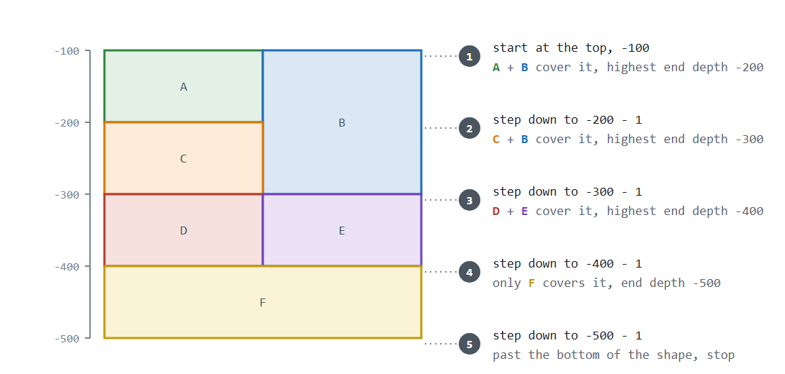

# 3D shape processing

## Context

A `feature` is made up of a collection of `polygon`s that combined define a geographic area that can represent a licence block,
subarea, reference block or anything else. Each polygon occupies a flat area on a map, but also a vertical depth range, making it
3d. A single `polygon` can only span between two depths, to create a "cube", but when multiple polygons combine to form a 
`feature`, it can make a pretty complex 3d shape.

The ArcGIS JS SDK we use for most of our processing only understands 2D, so every 3D operation requires a mixture of Java
processing and the JS SDK.

## Depths

Depths are metres relative to mean sea level and always negative. A polygon occupies the range from its end depth up
to its start depth.

- A null start depth means the polygon starts at sea level (treated as `0`).
- A null end depth means the polygon has no floor (treated as infinite depth).

Both conventions are recorded on the fields in `Polygon`.

A polygon covers a depth `d` when `start >= d > end`. The bottom is exclusive: a polygon that stops exactly at `d`
does not cover `d`.

## Generic approach for processing 3d shapes

1. **Get all the polygons** of the feature being checked.
2. **Group by depth.** Find every polygon of the feature that covers the X depth.
3. **Union the group** into one 2D shape. Polygons that touch must behave as one area, so never test them one at a time.
4. **Perform the 2d operation** on this slice.
5. **Step down** to the next depth where the group could change (highest end depth in the group - 1), and go back to step 2.
6. **Stop** once you pass the bottom polygon from step 1.
7. **Combine** the slice answers, then repeat for every polygon of the feature.

## Stepping down

Within a slice nothing changes, so the only depths worth checking are where a polygon starts or stops. In general,
step to the shallowest start or end depth, of any polygon involved, that is below the current depth. An operation can
take a shortcut when it knows fewer depths matter.

Every step moves down and there are finitely many polygons, so the sweep always finishes.

## Things to watch

- Check coordinate systems match before building any geometry. The 2D operators compare raw coordinates.
- Each slice costs one union and one 2D operation on the node server, per polygon, per step.
- Stop early once the overall answer is known.

## Examples

- [Feature containment](feature-containment.md)
