# 3d feature containment algorithm and test cases. 

## The algorithm

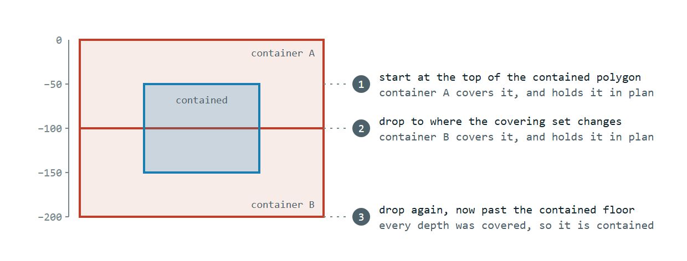

Containment follows the depth sweep in [3D shape processing](3d-shape-processing.md), which also covers how depths
are interpreted. The containment-specific parts are:

- **2D operation:** check the union of the containers covering this depth contain the given polygon
- **Combining:** every slice of every polygon must pass. The first failure ends the check.
- **Empty slice:** no container covering a depth means the feature is not contained.
- **Stepping:** drop to the shallowest floor among the containers currently covering. A gap below that floor shows up
  on the next step as an empty slice, so container tops never need checking.

The computation cost is one union and one containment check per depth step, per polygon of the contained feature.

## Test cases

### Contained by the union of touching containers in plan and depth

`isFeatureContainedBy_whenContainedWithinUnionOfTouchingContainersInPlanAndDepth_thenTrue` — contained

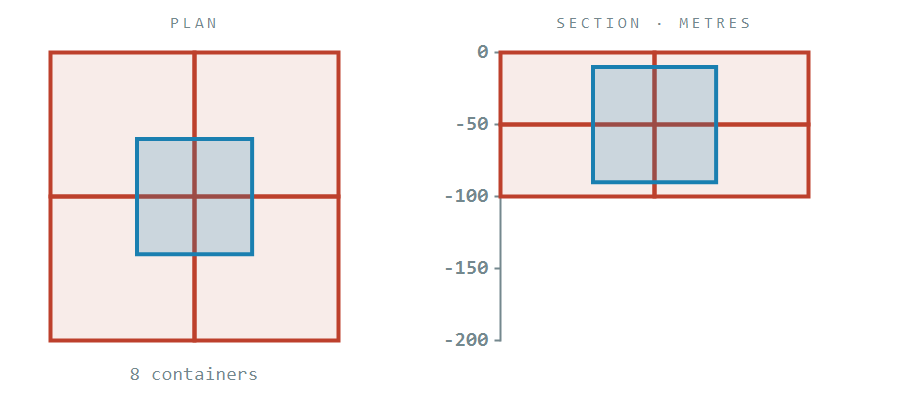

The same 2x2 quilt, now split into two layers that meet at -50 m, giving eight containers. The contained polygon
crosses both the plan cross and the layer boundary. The first step unions the upper four and the second the lower four.
Neither step finds a single container that holds it, and both pass.

### Containers staggered in depth

`isFeatureContainedBy_whenContainersStaggeredInDepth_thenFalse` — not contained

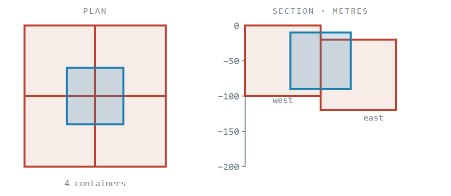

The eastern pair starts 20 m down, so at the contained polygon's first depth only the western pair qualifies, and that
half stops at the centre line the contained polygon crosses.

### A vertical gap between containers

`isFeatureContainedBy_whenContainersHaveADepthGap_thenFalse` — not contained

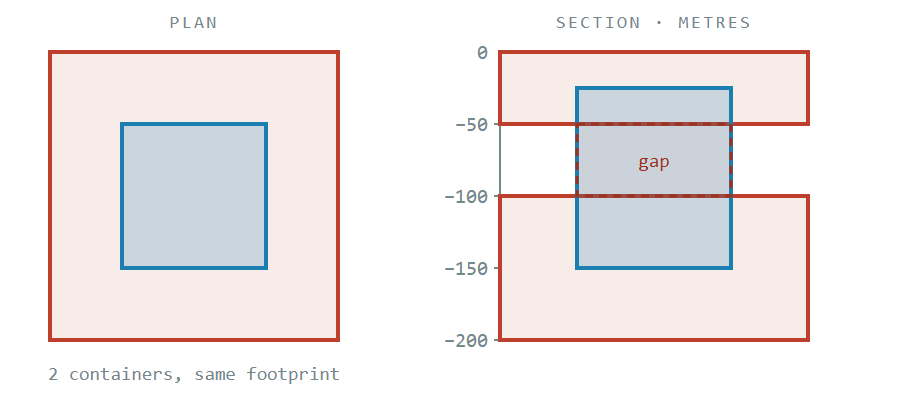

Two containers share a footprint that comfortably holds the contained polygon in plan, but nothing occupies -50 to
-100 m, which the contained polygon spans.

### Layered containers meeting exactly

`isFeatureContainedBy_whenContainersLayeredWithoutAGap_thenTrue` — contained

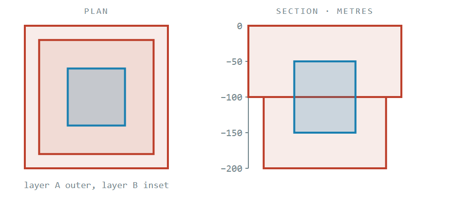

The upper layer hands over to the lower one at exactly -100 m and both hold the contained polygon in plan, so the sweep
clears -50 to -150 m in two steps.

### A deeper layer with the wrong footprint

`isFeatureContainedBy_whenDeeperContainerLayerDoesNotContain_thenFalse` — not contained

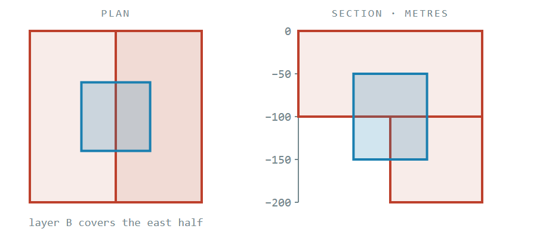

Identical depths to the case above, but the lower layer covers only the eastern half. The first step passes and the
second fails.

### Not contained in plan

`isFeatureContainedBy_whenNotContainedInTwoDimensions_thenFalse` — not contained

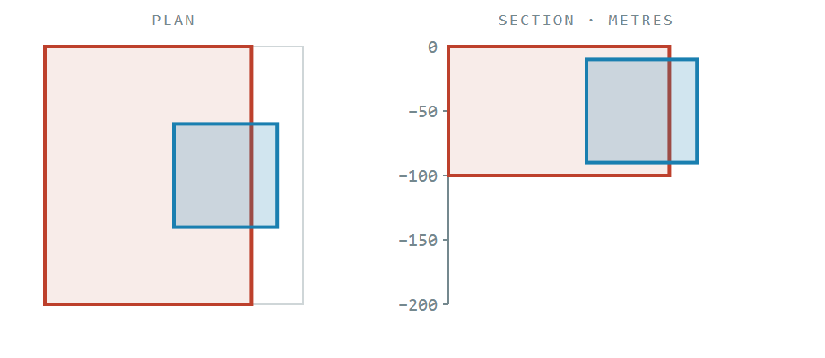

The depths line up perfectly and the contained polygon still overhangs the container's eastern edge, so the first step
fails and the sweep stops there.

### A container that starts below the contained polygon

`isFeatureContainedBy_whenContainerStartsBelowContained_thenFalse` — not contained

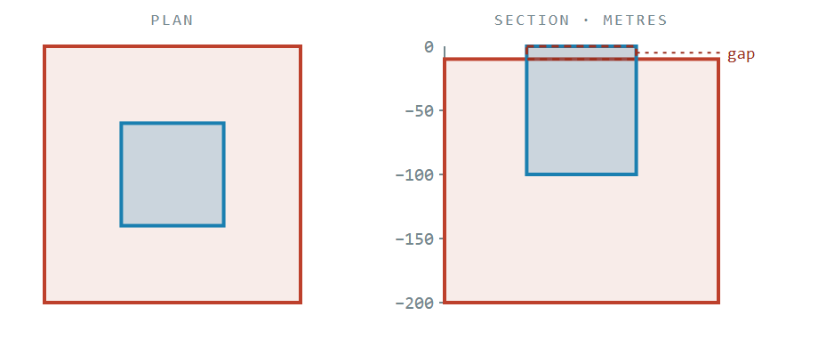

The container is deeper and wider than the contained polygon in every respect except the top 10 m, which nothing covers,
so the very first depth checked has no qualifying container.

### No depths given at either end

`isFeatureContainedBy_whenAllDepthsAreNull_thenTrue` — contained

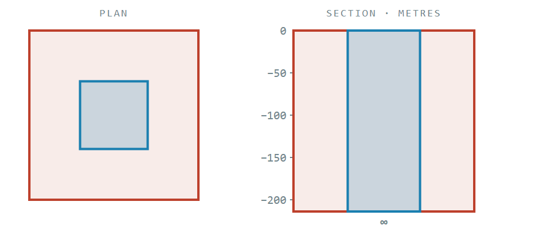

Both features run from sea level to infinite depth, so one step settles it.

### An unbounded contained polygon in a bounded container

`isFeatureContainedBy_whenContainedHasInfiniteDepthAndContainerIsBounded_thenFalse` — not contained

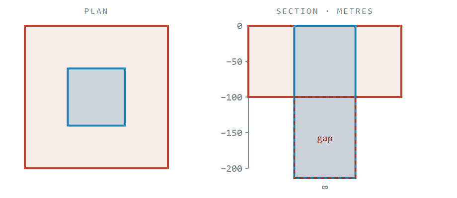

The contained polygon has no floor and the container stops at -100 m. A contained polygon with no floor can never be
held by a container that has one.

### A container spanning all depths

`isFeatureContainedBy_whenContainerSpansAllDepths_thenTrue` — contained

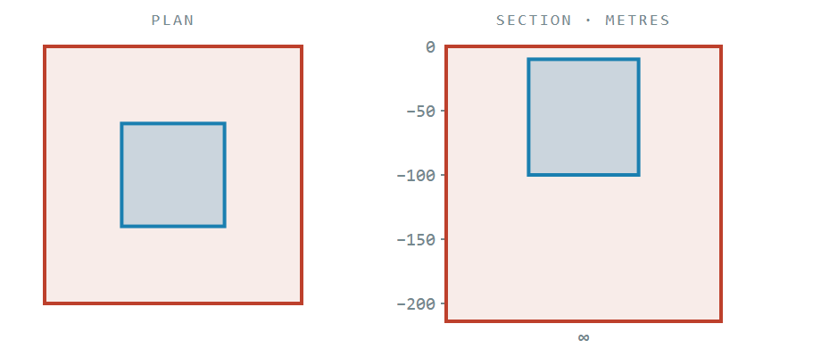

One container from sea level to infinite depth covers any bounded contained polygon in a single step — the common shape
of a real licence area.

### Every polygon of the contained feature contained

`isFeatureContainedBy_whenEveryContainedPolygonIsContained_thenTrue` — contained

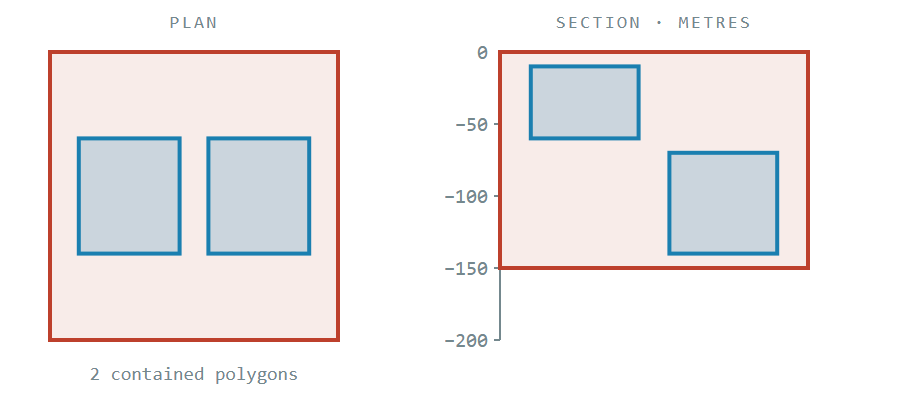

Two contained polygons at different depths, side by side in plan, both inside the one container. Two independent sweeps,
both clear.

### One polygon of the contained feature not contained

`isFeatureContainedBy_whenOneContainedPolygonIsNotContained_thenFalse` — not contained

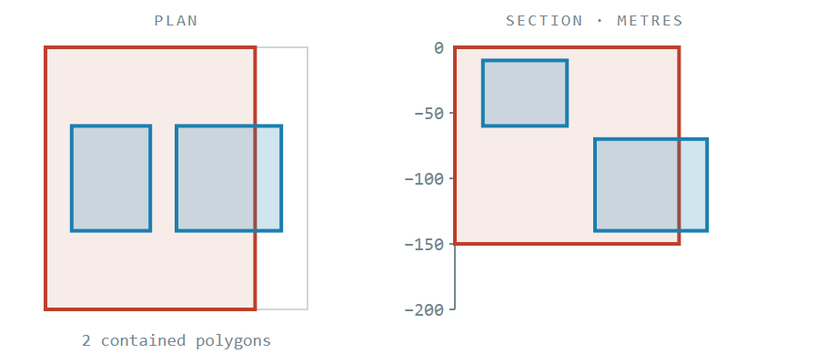

The shallower polygon is contained and the deeper one overhangs the container's eastern edge. One failure is enough to
sink the whole feature.

### Rejected input

| Condition | Result | Test |
| --- | --- | --- |
| The two features are in different coordinate systems | `IllegalArgumentException` | `isFeatureContainedBy_whenCoordinateSystemsDiffer_thenThrows` |
| The contained feature has no polygons | `IllegalArgumentException` | `isFeatureContainedBy_whenContainedFeatureHasNoPolygons_thenThrows` |
| The container feature has no polygons | `IllegalArgumentException` | `isFeatureContainedBy_whenContainerFeatureHasNoPolygons_thenThrows` |

All three are rejected before any geometry is built, so a bad call costs nothing on the node server. Different
coordinate systems throw rather than return a result because the containment check compares raw coordinates, which would
make the answer meaningless rather than merely imprecise. An empty feature throws rather than returning false so that
missing geometry surfaces as the data error it is.
