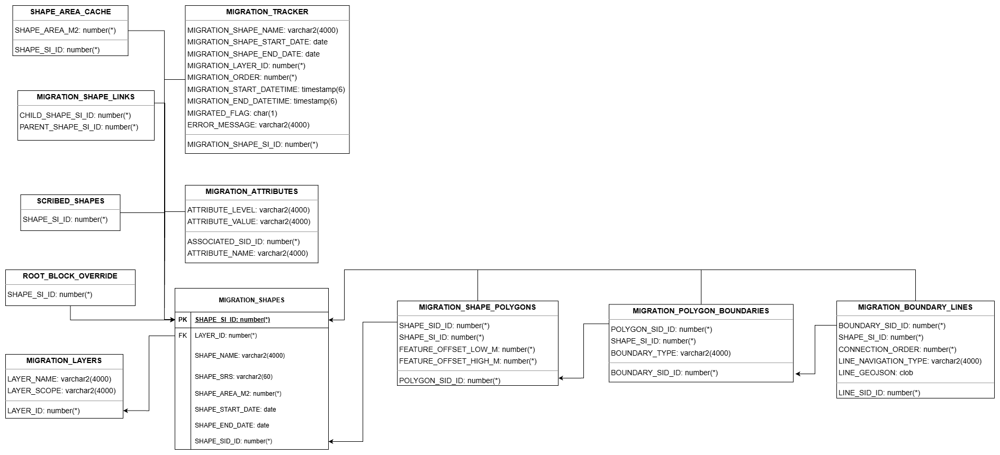
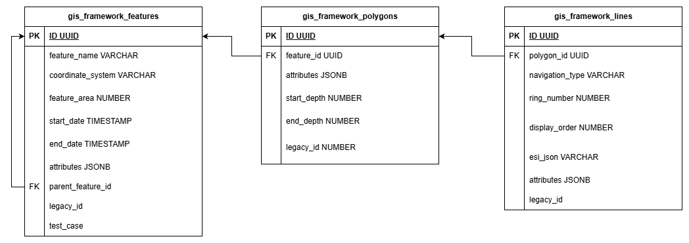
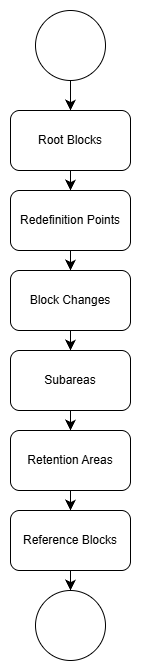
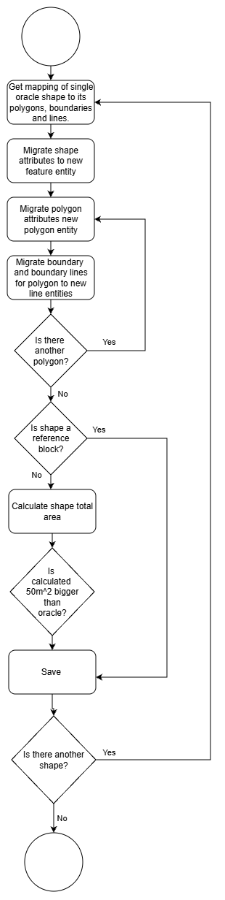
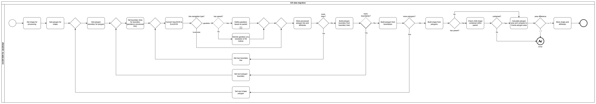
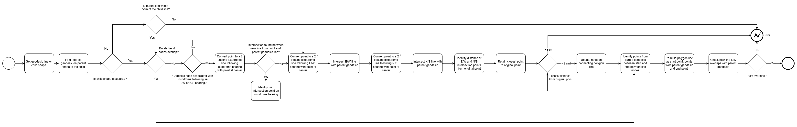

# GIS Migration

The GIS migration entails migrating all the Geographic Information System (GIS) data off of Oracle, which additionally includes
all the licensing-related information (not included as part of this migration), into Postgres.
Crucially, however, we are also switching from the Oracle Spatial framework into the new ArcGIS JS framework for manipulating the
GIS data, explained further below.

Additional background context to this write up can be
found [here](https://docs.google.com/presentation/d/1BvXyQmAJR6meqx3w4GcneLGrTXexSiC5C4LtC4ahNtA/edit?usp=sharing).

## Data models

The current data is tied to applications and sits within PEARS. Since the GIS migration is just focusing on migrating
GIS specific data we've extracted this data into a separate schema within oracle.

### Premigration oracle schema

**Notes:**

- A "shape" is broken down into four main entities: shapes, shape_polygons, polygon_boundaries, and boundary_lines. In the new
  world we don't need a `boundaries` table which determines if a line is internal or external due to the way EsriJSON is
  formatted. Internal rings are anti-clockwise, while external are clockwise.
- **shape_area_cache:** Is a cache of the area for each shape, this is done to speed up reruns of populating this schema as the
  area calculation is quite computationally expensive.
- **migration_tracker:** This table is the tracker used when populating the Oracle schema, however, we use the `migration_order` +
  the `migration_start_datetime` to determine what order to migrate the shapes into Postgres.
- **migration_shape_link:** This table is used for determining how to handle geodesic lines.
    - Parent shapes, which are those
      without a link or link to themselves, have their geodesics densified. Child shape's geodesic lines snap to their parent's
      geodesic line and copy down the relevant dense points.
    - In most cases the parent shape of any child is its root shape (the original licence block), except for in the shape appears
      in the `root_block_override` table, in which case the child shape points to itself, indicating it should be treated as a
      root block.
- **scribed_shapes:** This was used to calculate the connection order for lines, however, after discovering a bug in the oracle
  line numbering, we decided to not use this numbering.
- **root_block_override:** This table is used in the algorithm populating the links table. Any shape in this table was previously
  a "child" shape but is now a "parent" shape for reasons discussed below.
- **migration_attributes:** This table maps attributes to shapes/polygons/boundaries/lines.
- **migration_layers:** This table indicates what layer/shape type a shape is.

### Postmigration postgres schema

**Notes:**

- **gis_framework_features:**
    - `parent_feature_id`, `legacy_id` (the shape Si Id), and `test_case` columns will be dropped after
      migration.
    - `attributes` will contain the attributes for the shape from the `migration_attributes` table, and also the layer, as a JSONB
      map.
- **gis_framework_polygons:** `legacy_id` (the polygon Sid Id) column will be dropped after migration.
- **gis_framework_lines:** `legacy_id` (the line Sid Id) column will be dropped after migration.

## Oracle Spatial vs ArcGIS framework

ArcGIS JS SDK is the new framework we have chosen to use for performing GIS operations as it provides a lot of features and is
easy to use, doing most of the heavy lifting.

One key difference is in Oracle, we store the lines in GeoJSON, which is used by the oracle spatial framework. The ArcGIS JS SDK,
however, uses EsriJSON, which does have the additional benefit of storing the spatial reference system (SRS) as part of the JSON.

Another important difference is, while the ArcGIS JS SDK is a lot simpler, and easier to use, it does not have _set_ or
_relationship_ operators for geodesic shapes, unlike the Oracle framework. This means in the new world we will need to treat our
geodesics like loxodromes. We can achieve this by densifying the geodesic lines, which effectively makes a number of smaller
loxodrome lines. In the oracle world we only needed to store the start, and end nodes for a geodesic line. Now we will store the
densified line with all its points in the database, and we will continue to mark these lines as geodesic.

## Migration pipeline

### Order of shapes to migrate

The shapes need to be migrated in the specific order above. This order is important so that we can densify geodesic lines of all
the root blocks and cascade the dense points to the block changes, subareas, retention areas, and reference blocks. If we didn't
do this and instead densified all the geodesic lines rather than cascade the points down, then we'd end up with lines that don't
overlap due to the densification creating different nodes where a non-root block only has part of the geodesic line segment.

### Migration at a high level

The above is a digram is a high-level overview of the java migration from Oracle to Postgres.

### Migration algorithm

The above is a more detailed diagram of the whole GIS migration.

### Geodesic densification algorithm

The above is a diagram of the algorithm determining when and how we are densifying and cascading geodesic lines.

### Validation

After migrating all the shapes we run the following validation:

For subareas and blocks we validate:

- Each parent in `migration_shape_links` contains all of its children.
- The geodesic line of each child in `migration_shape_links` overlaps its parent geodesic line.
- The union of subarea polygons defined in `migration_shape_links` is topologically equal to the union the parent polygons.

For retention areas we validate:

- These retention areas are contained by the union of all its linked licence blocks.
- Any of the retention area's geodesic lines overlap its linked licence block geodesic lines.

For reference blocks we validate:

- Licence blocks are spatially contained within their reference blocks
    - If this errors, this could be due to an old licence block that spans multiple reference blocks, in which case we'd review
      manually and determine what to do.
- Reference block geodesic lines overlap their licence block geodesic lines.

## Oddities

**<u>Licence block geodesic line change</u>**

The most common error preventing shapes from being migrated was child shapes found in the `migration_shape_links` table not having
geodesic lines that overlap their parent. Initially we assumed that on a given block change the geodesic line would only ever be
cut back, meaning the resulting child shape's geodesic line would overlap the parent. In some cases, however, the geodesic line
had been completely redrawn, normally to correct an error in how it was drawn. This would lead to the new line being outside the 5
cm shifting tolerance for blocks and 1 m tolerance for reference blocks, preventing it from being migrated.

Our solution to this was to include these blocks in the `root_block_override` table, which means we treat them as root blocks and
redensify their geodesic lines, rather than cascade the points down from its root block. We then point all later block changes
and subareas to this as the parent in the `migration_shape_links` table, so they can cascade the new densification.

**<u>Relinquished subareas not ended</u>**

In some cases subareas were completely outside their parent shape. This would fail our validation, which checks that child shapes
are within their parent.

Our solution to this was to also include these blocks in the `root_block_override`. Treating them as a parent shape so their
geodesic lines get densified, since by definition it has no parent it is contained by.

**<u>Incorrect navigation type</u>**

In occasional circumstances we found some child shape's lines went outside their parent shape. After manually reviewing we
found these lines were incorrectly marked as loxodromes when defining a treaty boundary, so they didn't get shifted and cascade
their parents' dense points.

Our solution is to correct the data on live, so that we only migrate valid shapes.

**<u>Union of subareas not topologically equal to their licence block</u>**

In some cases post-migration validation failed, where the union of all child shapes for a parent did not equal the union of the
parent shapes. The cause for this seems to be missing data, so we can either correct the data on live or ignore the validation
errors where this was the cause. This will require manually validating on prod as this validation error could be legitimately
triggered for other reasons.

## Running the migration

The migration is run in two stages. The Oracle preprocessing is manually executed by running the PSQL scripts in
`java/uk/co/fivium/gisframework/migration/oracle-scripts`.
The migration to the new EsriJSON and the Postgres tables is done by hitting an actuator endpoint, which will migrate all
the shapes in one go, logging all successful and unsuccessful shape migrations.